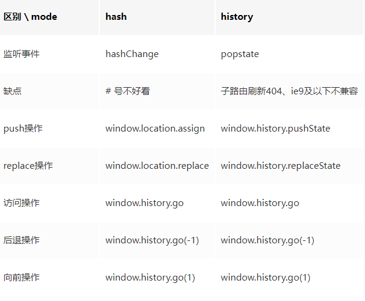

#

## router 路由

前端页面的路由通过 hash 模式实现，每次跳转并不是切换页面，而是在同一个页面内进行跳转，也称为 spa 页面

```kotlin
//创建
let router = new VueRouter({
 //匹配规则
  routes:[
       {
          path:'',
          component:()=>import('')//使用懒加载载入页面，
          meta:{ //此路由的一些信息}
          redirect：''//路由重定向，填路由的path进行替换，如要默认显示子路由加父路由页面的话，这里填完整的路由path（父路由path+子路由path）
          name： '' //路由的命名
          children:[
                  //子路由，相当于一个routes，使用子路由需要在父路由页面放置一个router-view的路由坑
                { path：'',
                 components:{
                      //多组件路由，通过在<router-view name = 'left'></router-view>来渲染不同的组件
                   defalut：组件1;
                     left： 组件2;
                 }
            } ]
         }
       ],
       mode：'history' //启动history模式，页面url中不会出现#号
      linkActiveClass： '' //路由高亮时的样式，这里指的是<router-link></router-link>的样式

})

//to表明要去哪个路由，tag是将此标签装饰为别的标签，replace则是取消回退,即没有保留浏览记录
<router-link to=""  tag ="" replace></router-link>

```

## 动态路由

```kotlin
//query传参
<router-link to='test?id=10'></router-link>
//调用（在路由跳转后的页面调用） this.$route.query  得到是一个对象{id：10}
//params传参
<router-link to='test/10'></router-link>
//对应的路由表中path改写{path:'test/:id'}
this.$route.params //得到一个对象 {id：10}

//利用$router的主动式路由跳转及传参
//query传参，与params传参的不同之处在于，query会将传递的参数展示在浏览器的url路径上，而params不会。相当于query是get请求，而params是post请求
this.$router.push("/test?id=222");
this.$router.push({path:"/test",query:{id:222}}) //注意，对象写法的query传参，必须是path和query的搭配
//以上两种都是query传参，在跳转后的页面通过this.$route.query都可以拿到一个对象，{id:222}

//params传参
this.$router.push({name:"testName",params:{id:333}}) //注意，对象写法的params传参，必须是name和params的搭配
//在跳转后的页面通过this.$route.params都可以拿到一个对象，{id:333}
```

## 路由对象和路由参数对象

```kotlin
// 路由对象
$router  // 可操作路由的走向 this.$router.push({path:''}),也可以用 this.$router.push({name:'',params:{}})进行跳转
this.$router.push() //可操作路由的走向

// 在浏览器记录中前进一步，等同于 history.forward()
this.$router.go(1)
// 后退一步记录，等同于 history.back()
this.$router.go(-1)

//repalce,效果和push相同，也是跳转路由，但是这种不会留下浏览记录，即无法回撤
this.$router.replace();

// 路由参数对象
$route  // 可以拿到路由中的信息 this.$rote.fullPath拿到路由路径的全部，this.$rote.meta拿到路由route的信息
```

## 路由内的各个钩子

```kotlin
// 全局路由守卫（写在router实例化的文件中）
// 注意全局路由守卫，在每次路由发生改变后，就会被触发
// 跳转前：
router.beforeEach((to,from,next) => {
        to //要跳转的路由对象即route
        from //跳转前的路由对象
        next() //一定要写这个，要不然无法进行跳转，也可以在next（‘’）写路由的path来改变路由的跳转，
})
// 跳转后：
router.afterEach((to,from,next) => {

})
// 全局路由解析守卫：
router.beforResolve((to,from,next) => {
    //效果和beforeEach相同，但是执行的顺序不同
})


// 路由独享守卫(当此路由发生了改变才会触发)
{path：‘’ ，component：‘’ ，beforeEnter((to,from,next)=>{

})}

// 组件独享守卫(写在组件的vue文件中):
//test组件中
export default {
//进入该组件之前触发
beforeRouteEnter: function(to, from, next) {
    //这里无法通过this拿到vue实例，只能通过在next方法中的回调拿到vue实例，注意只有这个钩子有回调函数
    next(vm=>{
        vm //vm就是vue实例
    })
  }

 // 在当前路由改变，但是该组件被复用时调用
 // 举例来说，对于一个带有动态参数的路径 /test/:id，在 /test/1 和 /test/2 之间跳转的时候，
 // 由于会渲染同样的 test 组件，因此组件实例会被复用。而这个钩子就会在这个情况下被调用。
beforeRouteUpdate: function(to, from, next) {

    //这里的this代表的是vue实例
    this
  }

//离开组件后之前触发
beforeRouteLeave: function(to, from, next) {
    //这里的this代表的是vue实例
     this
  }
}
```

## 路由解析的整个过程

::: info

- 导航解析开始
- 触发上一个组件的`beforeRouterLeave`方法
- 进入全局，触发全局的`beforeEach`方法
- 判断是否是动态路由，触发组件内部的`beforeRouterUpdate`方法
- 进入路由，触发路由配置上的`beforeEnter`方法
- 解析异步加载的组件
- 触发将要进入组件的`beforeRouterEnter`方法
- 回到全局触发`beforeResolve`方法
- 导航确认完毕
- 触发全局的`afterEach`方法
- 渲染 Dom
- 触发将要进入组件的`beforeRouterEnter`方法中 next 方法的回调函数
:::

## 路由 history 模式和 hash 模式的特点

:::info
`hash`模式就是 url 路径的#后面的部分，虽然在 url 路径中，但是并不会附加进 http 请求中，不会影响服务端的操作，即便修改了 hash 的内容，页面也不会重新渲染。同时可以对 hash 加上监听事件。兼容性好，但是不美观
`history`模式的实现主要是利用 pushState 和 replaceState 方法来修改浏览器会话的历史记录栈，虽然改变 url 路径，但是页面不是重新渲染。虽然美观但是刷新页面会出现 404，需要后端配合配置
:::


## router 异步引用组件的方式

::: info

- vue 异步组件
- ES6 的 import 方法
- webpack 的 require.ensure 方法
:::

```javascript
//vue异步组件
export default new Router({
  routes: [
    {
      path: '/home',',
      component: (resolve) => require(['@/components/home'], resolve),
    },
    {
      path: '/about',',
      component: (resolve) => require(['@/components/about'], resolve),
    },
  ],
})

//ES6的import方法
export default new Router({
  routes: [
    {
      path: '/home',',
      component: () => import('@/components/home'),
    },
    {
      path: '/about',',
      component: () =>import('@/components/about'),
    },
  ],
})

//webpack中require.ensure方法
export default new Router({
  routes: [
    {
      path: '/home',
      component: () => require.ensure([],'@/components/home', 'home'), //第三个参数为chunk名
    },
    {
      path: '/about',
      component: () => require.ensure([],'@/components/about', 'about'),
    },
  ],
})

```

router 的异步加载组件，可以达到按需加载模块，优化项目性能的目的，同时可以和 webpack 配合起来，按照路由维度的不同划分成不同的 chunk 代码块(即合成一个单独的 js 文件)，同时利用浏览器缓存策略，缓存这些 chunk 代码块
