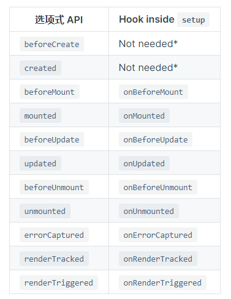
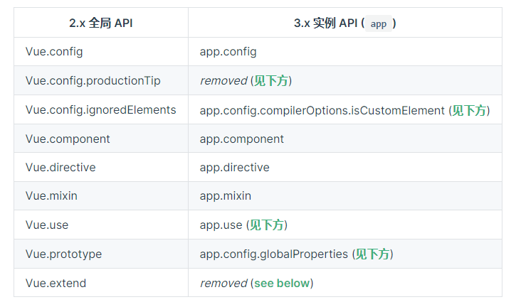
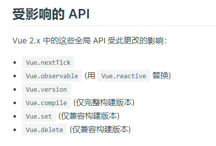

#

## vue2 生命周期

::: info

- beforCreate // 此时所有的数据并未写入，可在此时做初始化操作
- Created // 此时 data 和 method 已经存在，可发送请求，进行数值的处理,this.$data已经存在，this.$data === data.prototype，数据的绑定、watch 和 event 的回调、computed 的计算也已经完成
- beforMount // 此时虚拟 Dom 已经完成，但是未渲染到 Dom 中, 完成模板的解析以及指令的运行。
- Mounted // 创建期的最后一个钩子，此时 Dom 已经渲染完毕，this.$el 可获取，其为`<div id =‘app’> </div>`
- beforUpdate // 此时 vue 中 Data 的数据已更新完了，但是页面中的数据并未重新渲染
- Updated // 更新完毕，页面中数据和 Data 中的数据保持一致
- beforDestroy // vue 销毁前的最后一刻，data 和 method 都可以使用
- destroy // 被销毁
  :::

## Axios 请求

```javascript
// get请求
axios.get(url,{params:{要发送的数据}}).then(res => {
   // 如果没有拦截那么这里拿到的是响应对象
}).catch(err => {

})

// psot请求
axios.post(url,{
    // 传递的内容
    data:{},
    // 设置请求头内容
    headers:{
        // 传送的数据为json类型
        'content-type':'application/json;'
    }
}).then(res => {

}).catch(err => {

})

// 统一写法
axios({
  url:"",
  method: ,
  headers:{},
  responseType :" " // 响应类型，默认为json
 params or data  // 根据请求的方法来选择
}).then(res => {

}).catch(err => {

})

// 同时发送多个请求
axios.all([axios(),axios()]).then(data => {
   // data是一个数据，分别包含前面两个请求的结果对象
}).catch(err => {
})

// 全局属性
axios.defaults.timeOut= 5000 //规定请求时间
axios.defaults.baseURL = '' //规定每次请求的域名和端口，每次请求会附加上这串

// 实例化
const a = axios.create({
       baseURL:''
})

// 请求和响应拦截 (一般写在创建axios的文件中)
axios.intercptors.request.use( config => {
   // 拿到请求对象，可以做类似于判断是否带token的操作
   return config //一定要返回这个，要不然请求会一直卡在这
})

axios.intercpotors.response.use( res => {
  // 拿到响应对象
  return res.data //这样就可以不用每次请求是在去res.data拿数据，而是直接res即可
})

```

## keep-alive（组件状态保留）

```javascript
// keep-alive实际上是将要保留状态的组件的vnode保存进cache对象中，当要使用这个组件时，就从cache中拿出来渲染页面
// 使用了LRU算法,会将最近最久会使用的组件状态销毁

<keep-alive
  include=""
  exclude=""
  max="2"
>
  //
  确定哪些组件要被保留状态，哪些不用，里面填入的name，即在每个组件中script中定义name
  // include表明哪些组件的状态需要保留 // exclude表明哪些组件的状态不需要保留 //
  max表明最多可以保存多少个组件的状态 // 可以放<component></component> 或者 <router-view></router-view>
</keep-alive>
```

## component 组件

```javascript
// 全局组件的两种创建方式
// 第一种
let te = Vue.extend({
    template:''
})
Vue.component('组件名字'，te)

// 第二种
Vue.component('组件名字',{template:'#id'})
<template id = 'id'> </template>

// 私有组件
let vm = new Vue({
   components:{
   }
})

// 父向子组件的传值
<son :data = “msg”> </son>
let parent = new Vue ({
     data:{
        msg
     }
})

let Son = new Vue({
  props:{
     data:{
          type:string;
          defalut:'ss'
     }
  }
})

<div>{{data}}</div>


// 子向父组件传方法

<son @data = “father”> </son>
let parent = new Vue ({
      methods：{
       father（data）{

    }
    }
})

let Son = new Vue({
       methods:{
         useFahter（）{
          this.$emit('data',参数1)
    }

  }
})


// 父向孙传递方法一致，但需要在子组件上做处理
<div :data='' @father=''></div> 父
<div :data = '$attrs' @father='$listeners'></div> 子
<div @click = "uesFather">{{data}}</div> 孙

```

## render 渲染

```vue
@import componentOne from ''
<div id="app"></div>
// 用componentOne组件替换原来的app let app = new Vue({ el:'#app' render(el){
return el(componentOne)} })
```

## filter 过滤器

```vue
Vue.filter('过滤器名'，function(data){ // data参数为固定值，为要进行过滤的数据
}) // 调用方式（只能在v-bind和{{}}中调用）
{{ data | 过滤器名 }}
```

## directive 指令

```vue
Vue.directive('命令名',{ inserted(el){ //绑定此命令的元素插入进Dom中时执行 //
el为绑定此命令的dom元素 } bind（el）{ //当此命令绑定到元素上时执行 }
updated（el）{ //此元素发生改变后执行 } }) // 调用
<div v-命令名></div>

// 快捷写法 Vue.directive('命令名',function(el,bing){ //
此方法代表bind和updated方法 // bing.value可得到 v-命令名 = ‘’中等号后面的值 })
```

## vueX 状态管理

用于解决不相关组件之间的传值

```javascript
  let Store = new Vue.store({
            state: {
                a: 'a'
                //公共数据
                调用方法 this.$store.state.a
            }
            mutations: {
                //任何想要改变state中数据的行为必须调用mutations的对应的方法
                test(state) {
                    通过state.a的方式获取state中的数据
                }
                通过this.$store.commit('mutations中的方法名'，
                    参数) 来调用
            }
            getters： {
                //对state中的数据进行加工来返回给调用者，但是不修改state中的数据
                test（ state） {
                    return state.a + 'b'

                }
                //通过this.$store.getters.test来调用
            }
            actions： {
                //所有的异步方法都写在这中
                test（ store） {
                    得到store对象， 调用其数据与上面所写调用方法一样

                }
                //通过this.$store.dispatch('方法名'，参数)来调用

            }
        })
```

### `module`多状态管理

```javascript
let store = new Vue.store({
   modules:{
       moduleA:{
              namespaced: true, //因为vuex中mutations、gettes和actions不管是多少个模块，都是处在同一个执行环境中，即通过对应的方法名就可以调用，而加上这个就需要在调用的时候加上模块名
              state:{
                  a:"1"
                  //通过this.$store.state.moduelA.a 来调用
              },
             mutations:{
                 getA(state){
                     //state代表模块内部中的state
                 }
                 //有namespaced时，通过this.$store.commit("moduleA/getA")来调用
                 //没有namespaced时，通过this.$store.commit("getA")来调用
             },
             getters:{
                 getA(state,getters,rootState){
                     //state代表模块内部是state数据
                     //getters可以用于调用其他模块的getters中的方法，即getter['moduleB/getA']
                     //rootstate可以用于调用主模块中state的数据
                 }
                 //有namespaced时，通过this.$store.getters["moduleA/getA"]来调用
                 //没有namespaced时，通过this.$store.getters.getA来调用
             },
             actions:{
                 async getA({state,commit,dispatch,getters,rootState}){
                      //state代表模块内部是state数据
                     //getters可以用于调用其他模块的getters中的方法，即getter['moduleB/getA']
                     //commit可以用于调用其他模块的mutations中的方法，即commit('moduleB/getA')
                     //dispatch可以用于调用其他模块的actions中的方法，即dispatch('moduleB/getA')
                     //rootstate可以用于调用主模块中state的数据
                 }
                  //有namespaced时，通过this.$store.dispatch("moduleA/getA")来调用
                 //没有namespaced时，通过this.$store.dispatch("getA")来调用

             }
       //比较特殊的一点，Actions中的函数是可以返回一个promise对象的，然后用dispatch调用时，可以用then方法设置回调函数
           actions: {
               testA() {
                   return new Promise(function(resolve, reject) {});
               },
               testB({ dispatch }) {
                   dispatch('moduleA/testA').then(res => {

                   })
               },
               //也可以这样写
               async testB({ dispatch }) {
                   const res = await dispatch('moduleA/testA');

               }
           }
       }
   }

})
```

### mapState、mapMutation、mapGetters 和 mapActions 辅助函数的使用

```javascript
//在要使用的vue文件中
import { mapState, mapMutations, mapGetters, mapActions } from 'vuex'
export default {
  computed: {
    //mapState的作用在于，当要多次调用state中不同的数据时，一个个在computed中写的话，会造成代码臃肿的问题
    //mapState,mapMutations,mapGetters,mapActions都返回一个对象
    //如果调用模块有namespaced则，第一个参数为模块名，后面的为要调用的数据,如果没有，则不需要传
    ...mapState('moduleA', ['testA']),
    //这等同于在computed中增加了一个testA对象
    testA() {
      return this.$store.state.moduleA.testA
    },
    //还可以通过对象来来传入内容
    ...mapState('moduleA', {
      testA: 'testA',
      //或者
      testA: (state) => state.testA,
    }),
  },
  methods: {
    //mapMutations,mapGetters,mapActions都是要通过在methods中写才有用
    ...mapMutations('moduleA', ['testA']),
    ...mapGetters('moduleA', ['testA']),
    ...mapActions('moduleA', ['testA']),
    //也可以通过传入对象的方式来写
    //通过this.testA()就可以调用方法
  },
}
```

## mixin 混入

用于功能的复用

```javascript
// 局部定义：
let  mixin  = {
   created(){
       //混入中的钩子函数要比使用它的组件的钩子函数先触发，然后再触发组件的钩子函数
}
 data(){
     return {
         //若混入中data中定义的变量名与组件中的一致，那么只使用组件中的，而不使用混入中的
   }
  }
 methods{
    // 若混入中的方法名与组件中的方法名一样，则使用组件中的方法
   }
}

let vue = new Vue({
    mixins:[mixin]
})

// 全局定义：
vue.mixin('混入名',{

})

// 全局定义的混入对每一个组件都有效
let a = 'b'

let vue = new Vue({
  data(){
    return {
    b : this.$options.a //那么b的值为'b'
    }
   }
})
```

## $options 对象

用于获取不在 vue 独有方法（例如 data、method）中定义的方法或者属性

```javascript
export default {
  s: '2',
  testB: function () {},
  methods: {
    change() {
      console.log(this.$options.s, 888) //得到s的值为'2'
    },
  },
}
```

## $event 事件对象

```vue
// $event的使用
// 原生事件中代表事件对象
<div @click = "test">

</div>
test(){
   //默认第一个对象是事件对象 $event
   $event.target.xxx  //获取此标签上的各种东西
   $event.srcElement //获取原生的Dom标签
}

// 如果是自定义的事件，则代表$emit传过来的第一个参数
// 例一：
//父组件
<children @event = "test($event)">
</children>

test(tes){
     tes //等于子组件传过来的第一个参数值
}

// 子组件
  <div @click = 'test'>

 </div>
 test() {
  this.$emit（"event",'a'）
}

// 例二：
// 父组件
<children @event = 'tes = $event '> tes就等于子组件传来的第一个参数值</children>

 data(){
    return {
      tes:''
     }
}
// 子组件
 <input type = "text" @input = "$emit('event',$event.target.value)"> </input>

```

## $mount 对象挂载

适用情况：在一个 vue 实例中需要在某个标签上挂载另外一个 vue 实例时

```javascript
<template>
  <div id="app"></div>
</template>

import needMountVue from " "
export default {
    methods:{
        test(){
            let tempVue = new Vue(needMountVue); //这里得到的tempVue实际上就是needMountVue中的this
            tempVue.test = '23'
           // 这样在needMountVue中就可以通过this获取到test的值，但是这种传值方式这能用于beforeMount、mounted时才能获取到
           tempVue.$mount("#app")
           }
        }
    }

// 也可以按照以下方式写
import testMountVue from '';
export default {
    methods:{
        test(){
            let testMount = Vue.extend(testMountVue);
            const instation = new testMount().$mount("#app");
           }
      }
  }
```

## $refs 对象

```javascript
// 用在原生标签上时
<div ref = 'sed'></div>
this.$refs.sed //得到div这个Dom对象

// 用在组件上时
// 子组件
 data (){
  return {
    a: 'c'
  }
}

<children ref='son'></children>
this.$refs.son.a  //得到c,获取到的是组件对象，但这种只能在mounted（）钩子中获取，不可在渲染期获取

// 用在v-for循环的对象时：
<div v-for='item in 3' :key = item ref='te'> </div>
this.$refs.te //得到一个数组，数组内是3个div的Dom对象
```

## $el 对象

```javascript
;<template>
  <div>
    <p id="test"></p>
  </div>
</template>

import Test from ''
export default {
  el: '#test', //这个表明要挂载在id为test的标签上
  mounted() {
    //$el在组件创建的阶段中,只有mounted的钩子函数中才能获取到
    //如果在vue文件中有明确的写出el，那么下面的$el就会使绑定的html，即,<p></p>
    //如果没有明确的写出el，那么vue会默认的把除<template></template>这个标签剩下的html当做el，即<div><p></p></div>
    console.log(this.$el)

    //Test文件中有<template>
    //       <div>
    //        222
    //     </div>
    // </template>
    let test = new Vue(Test) //根据Test文件获取得到一个vue对象
    //手动的完成vue对象的创建，同时返回vue对象，即this
    //$mount('#test') 传入的#test,实际上就是去寻找id为test的dom节点，并将vue对象挂载在这个节点上
    // 最终得到的vue
    //<template>
    //      <diV>
    //     <p id="test">
    //       <div>
    //        222
    //     </div>
    // </p>
    // </diV>
    //</template>
    test.$mount('#test')
  },
}

// 通过$el进行挂载
new Vue({
  el: '#app',
  data() {
    return {
      message: 'Hello Vue!',
    }
  },
  template: `
    <div id="rendered">{{ message }}</div>
  `,
})

//上面等同于
const app = new Vue({
  data() {
    return {
      message: 'Hello Vue!',
    }
  },
  template: `
    <div id="rendered">{{ message }}</div>
  `,
})

app.$mount('#app')
```

## new Vue 之后进行的操作

::: details

- 划定作用域，使当前组件无法访问其他组件的数据
- 确定父子组件关系，同时为当前组件赋予一些属性和生命周期标识（ref，$parent,$children 等）
- 对父类传进来的事件添加监听
- 声明 solt()、createElement()等
- inject 注入从外部传进来的数据
- 响应数据的初始化,包括 data、methods、props、computer、watch
- provide 提供数据给子组件
- 进行挂载

先 inject 数据再 provide 数据，是因为

- 外部传入的数据需要跟 data 中的数据进行比对，当同名时给予不同其权重，剔除重复的数据
- 提供给子代数据，先要获取到这个数据，才能提供给子代
  :::

## vue2 的数据双向绑定（观察者模式）

核心是利用 Object.defineProperty 方法的 get 和 set 属性

```javascript
//obesever:观察者，当数据发生了改变就通知dep去重新渲染页面。
function obesever(obj) {
  for (let item in obj) {
    let dep = new _dep()
    let value = obj[item]
    if (Object.prototype.toString.call(value) === '[object,object]')
      obesever(value)
    Object.defineProperty(obj, item, {
      configurable: true,
      enumerable: true,
      get: function reactiveGetter() {
        if (_dep.target) dep.addWatch(_dep.target)
        return value
      },
      set: function reactiveSetter(newVal) {
        if (newVal === value) return value
        value = newVal
        dep.notifyAll()
      },
    })
  }
}

//dep:连接者，对象的每一个属性都对应着一个dep，dep内有一个数组，数组中是和此属性有关联的watch对象
function _dep() {
  this.watchList = []
  //为这个属性添加更新者
  this.addWatch = function (watch) {
    if (_dep.target && !this.watch.includes(_dep.target))
      this.watchList.push(watch)
  }
  this.notifyAll = function () {
    this.watch.forEach((item) => {
      item.upDate()
    })
  }
}

//watch:更新者，第一个初始化调用时会被加入进对应的dep中，dep循环数组后，在数组中的watch调用upDate方法更新数据和重新渲染

function watch(fn) {
  this.upDate = function () {
    fn() //这个回调函数中循环监听对象中的所有属性，并获取它们的属性值
  }
  this.initialize = function () {
    _dep.target = this //静态成员，为_dep对象添加一个静态成员
    fn() //这一步即是为每个属性创建一个_dep对象，且在每个_dep对象的数组内加入watch
    _dep.target = null //防止后面更新时，再次往_dep对象的数组内加入watch
  }
  this.initialize()
}

new __watcher(() => {
  var html = String(this.__originHTML || '')
    .replace(/"/g, '\\"')
    .replace(/\s+|\r|\t|\n/g, ' ')
    .replace(/\{\{(.)*?\}\}/g, function (value) {
      return value.replace('{{', '"+(').replace('}}', ')+"')
    })
  html = `var targetHTML = "${html}";return targetHTML;`
  var parsedHTML = new Function(...Object.keys(this.$data), html)(
    ...Object.values(this.$data)
  )
  this.__root.innerHTML = parsedHTML
})
```

## 父子组件的渲染顺序和销毁顺序

- 组件的调用顺序都是`先父后子`,渲染完成的顺序是`先子后父`。

- 组件的销毁操作是`先父后子`，销毁完成的顺序是`先子后父`

```info
父子组件的渲染顺序：
父beforCreate -> 父created -> 父beforMount -> 子beforCreate-> 子created -> 子beforMount -> 子mounted -> 父mounted
子组件的更新：
父beforUpDate -> 子beforUpdate ->子updated -> 父updated
父组件更新：
父beforUpDate -> 父updated
父子组件的销毁:
父beforDestory -> 子beforDestory ->子destoried -> 父destoried
```

## 组件的各类传值方式

```javascript

// $是vue中内置属性和方法的前缀，用于分开自定义的属性和方法。
this.$data 相等于 vue中定义的 data：{}

// 父向孙传值：
this.$attrs //获取到当前组件父组件上传给其的绑定属性，除开当前组件中props已经定义的属性
$props //不可以通过this.$props获取到，其与当前组件中的props一样，props中定义好的属性，在组件创建好后会进入data中，所以可以用this来获取
this.$listeners //获取到当前组件的父组件上传给其的绑定方法,其里面的方法也不能通过this直接调用，只用this.$emit("方法名")来调用

// 父组件:
<template>
  <chidrens :data = "msg" @test="test">
  </chidrens>
</template>
data:{
  msg:'de'
}

// 子组件:
<template>
    <grandson v-bind="$attrs" v-on="$listeners">
      // 这里的v-bind 其实等于 data =‘$attrs.data’,v-on等于 @test=‘$listeners.test’
    </grandson>
</template>
// 通过 this.$emit("test")调用父组件方法

//孙子组件:
<template>
  <span>{{$attrs.data}}</span>

  // 也可以这样(要加上props)
  <span>{{data}}</span>

</template>
props：['data']
//通过 this.$emit("test")调用父组件方法

// 兄弟组件的传值方法：
$on //用于执行当前实例上的方法
$emit //用于调用当前实例上的方法，此方法也可以是不在method中定义的，不过这样的话需要使用$on执行

// 在全局定义一个vue实例
this.bus = new Vue();

// 兄弟组件一：
host(){
 this.bus.$emit("test",'sd')
}

// 兄弟组件二:
hostTwo(){
this.bus.$on('test',function(data){

})
}

// 父向子、孙子或者更下级的组件传值:
父组件:
export defalut {
  provide(){
   return {
      test:this
 }
 }
}

// 孙子组件：
export defalut {
inject:['test']
}

// 父组件:
export defalut {
  provide (){
  return {
   reload:this.reload
  }
},
 methods :{
  reload () {
      this.$nextTick(() => {})
  }
 }
}

// 孙子组件:
 inject:['reload']
//需要刷新页面的方法
 needReLoad(){
 this.reload();
}

// 父子组件之间的通信：
// 父组件：
 <template>
 <chlidrenOne></chlidrenOne>
<childrenTwo></childrenTwo>
</template>
this.$children // 得到一个数组，数组内部是子组件一和二的vue实例对象即this

子组件:
this.$parnet //得到父组件的vue实例对象即this
```

## $nextTick 方法

::: info

- 适用情况：用于在下次 dom 更新循环结束后，执行回调函数，获取更改后的 dom 元素，实际上是利用微任务优先的方式使用异步任务执行 nextTick 包裹的方法
- vue 在进行 dom 更新的时候是异步的，当发现有数据发生改变，就会开启一个队列，并缓冲同一事件内发生变动的所有数据，当一个数据在同一个事件内多次改变，只会推入队列中一次，这样就避免多余的数据计算和 dom 操作，同时 nextTick 会在缓冲队列中加入回调函数，确保回调函数在缓冲队列中所有的 watch 触发执行完后再执行，从而获取最新的 dom
- 具体使用: this.$nextTick(() => {})
  :::

## vue 组件的继承

```vue
// 方法一 父组件
<template>
  <div>haha</div>
</template>
export default { methods:{ test(){ } } } // 子组件：
<template></template>
import fatherComponent from ''; export default{ extends:fatherComponent //
会继承父组件中的methods、data和template中的内容，但是如果子组件中有对应的方法和变量名的话，父组件的会被替换，且如果子组件的template中有内容的话就会替换继承来的父组件中的template中的内容
} // 方法二 父组件：
<template>
  <div>haha</div>
</template>
export default { methods:{ test(){ } } } //子组件: import fatherComponent from
'', export default { mixins:[fatherComponent], //使用混入继承 }
```

## .sync 修饰词和 v-model 的用法

.sync 主要用于当父组件向子组件传递了一个数据后，当子组件改变了这个数据，父组件也相应的改变这个数据

```javascript
// 父组件：
<template>
    <son :name.sync='msg'></son>
</template>
<script>
import son form '';
export default {
      data() {
          return {
              msg:'1'
          }
      },
}
</script>

// 子组件：
<template>
 <button @click="changeFatherData"></button>
</template>
<script>

export default {
      props:['name'],
      methods: {
          changeFatherData(){
              //通过emit进行改变
              this.$emit('update:name',23)
          }
      },
}
</script>
```

v-model 用于表单标签时，能实现数据的双向绑定，但用于自定义组件上时，能实现和.sync 一样的效果

```javascript
// 父组件：
<template>
     <son v-model="msg"></son>
     <!-- 等同于 -->
     <son :value='msg' @input='msg = $event'></son>
     <!-- 这里的$event其实就是子组件调用input方法时传入的第一个参数 -->
</template>
<script>
import son from " "
export default {
    components:{
        son
    },
    data(){
        return {
            msg:''
        }
    }
}
</script>

// 子组件：
<template>
</template>
<script>
export default {
    model:{
       prop:title, //这里修改从父组件中继承过来的value值的名字为title
       event:change, // 这里修改从父组件中继承过来方法的名字为change，即input变为了change
        //   <son :title='msg' @change='msg = $event'></son>
    },
    props:{
        value:{
            type:String,
            default:'',
        },
        title:{
             type:String,
            default:'',
        }
    },
    mounted() {
        this.$emit('input','sss')

    },
}
</script>
```

## observable（轻量数据管理中心）

相对于 vuex 来说很轻量，且使用方法也很简单

```javascript
// 这样就使obj这个数据具有了响应的特性
let obj = Vue.observable({
  a: 'a',
  d: 'v',
})

//和vuex类似，要想改变内部state的数据，需要通过方法
function changeA(data) {
  obj.a = data
}

// 导出这个响应的数据，方便不同地方引用
export default {
  obj,
  changeA,
}
```

## 非 prop 传入的 Arrtibute 数据($attrs)

```javascript
// 父组件
<template>
 <children :testA="testA" :testB="testB"  testD='testD' class="testC" style="color:red"></children>
</template>
<script>
import children from "./about/index";
export default {
    components: {
        children,
    },
    data(){
        return {
            testA:'a',
            testB:'b'
        }
    },
};
</script>

// 子组件
<template>
    <!-- 从父组件处接受到了绑定的属性testA、testB，不绑定的属性testD class 和style -->
    <!-- 在单根元素的子组件内，除写在props内的属性，其他的属性都会由根元素继承 -->
    <div></div>
    <!-- 即以上的div会变为<div testB="testB"  testD='testD' class="testC" style="color:red"></div>
    -->
    <!-- 注意没有写入props中的绑定属性，在根元素继承时，会变为不绑定的属性 -->

    <!-- 如果是多根元素的子组件，则不会发生继承，例如以下情况 -->
    <div></div>
    <p></p>

    <!-- 想要指定子组件中特定的标签来继承父组件的属性，则需要$attrs和inheritAttrs
     -->
     <div>
         <!-- 通过$attrs来将父组件的属性转接到p标签上 -->
         <p v-bind="$attrs"></p>
     </div>
</template>
<script>
export default {
    props: ["testA"],
    // inheritAttrs表明父组件的属性是否由根元素来继承，true则由根元素继承，false则不是
    inheritAttrs:false,

};
</script>
```

## vue3 的生命周期


## 组合式 API

::: info
作用：

- 解决代码可阅读性差以及可维护性差的问题
- 解决逻辑代码无法复用的问题
- 更好的支持 typeScript
  :::

```javascript
<template>
    <!-- 这里的a是从setup函数中返回出来的，虽然这个a是通过ref构造出来的，但是在只有在setup中需要使用a.value来访问值，在组件的其他地方使用直接调用其自身就可以，即写a -->
    <div>{{ a }}</div>

    <button @click="change"></button>
</template>
<script>
import { reactive, ref, toRefs, provide, readonly } from "vue";
export default {
    props: {
        testA: {
            type: String,
            default: "",
        },
    },
    //组合式API的核心方法，这个方法会在组件创建之前执行，即在beforeCreate之前执行
    setup(props, content) {
        //props是父组件传递进来的数据，如果使用解构的方式来获取其内部的数据，那么就会使props里的数据不再具有响应的特性
        let { testA } = toRefs(props); //通过toRefs这个函数，可以使数据被解构了，也能继续保有响应的特性

        //content是一个js对象，这个对象内包含slots、emit和attrs三个属性

        let a = ref([]); //通过ref的函数可以使一个自定义的数据具有响应的特性
        let b = ref("");

        a.value.push("1"); //ref的特殊性，在于要调用或者使用这个自定义数据的时候需要通过访问其value的属性来获得
        b.value = "2";

        let d = reactive([]); //也可以通过reactive的函数来使这个自定义数据具有响应的特性
        let e = reactive({
            a: "d",
            c: "e",
        });
        d.push("3"); //reactive函数构建的，直接调用就可以了，不用像ref那样
        e.a = "4";
        this;
        //因为是在组件创建之前执行的，所以这里的this指向的是undefined

        //如果setup是async...await形式的,大部分setup中只会执行第一个await(包括该await)之前的内容


        //setup返回的所有数据，可以在组件中任一处直接使用，这些数据会直接存在于组件的this中
        //也可以返回一个函数，函数内部返回由h函数渲染的标签，这个可以替换template中的内容
        return {
            a,
            b,
        };
    },
    methods: {
        change() {
            this.a; //在组件的中调用setup函数中返回的数据，需要用到this
        },
    },
};
</script>

//要注入数据的组件
<script>
import { inject } from "vue";
export default {
    setup() {
        //要注入数据的组件，通过inject来注入数据，第一参数是要注入数据的名称，第二参数给这个注入数据一个默认值
        //第二个参数是可选的
        inject("age", "12");
    },
};
</script>
```

::: info
生命周期的钩子函数：

在`setup`组合式 API 中以往的生命周期钩子函数，需要在前面加上 on 进行使用，且因为组合式 API 的调用时间是在组件创建之前，所以不再需要 beforeCreate 和 created 两个钩子，同时组合式 API 将 destroyed 和 beforeDestory 两个钩子函数转变为 onBeforeUnmount 和 onUnmount
:::



## 响应式

```javascript
import { computed, watch, watchEffect, ref, reactive, readonly } from 'vue'
export default {
  setup(props, content) {
    //使自定义数据具有响应的特性
    let a = ref(9) //返回给a的是一个js对象，其中的value属性的值等于传进去的9
    a.value //等于9

    let c = ref({
      a,
    })

    c.value.a //等于9,如果ref定义的数据存在于响应性对象中，那么调用的时候，只需要通过.名字即可获取到，不需要再.value来获取数据

    //reactive另外一种使自定义数据具有响应特性的方法，本质上是使用了Obeservavle方法
    let e = reactive({
      a: 'a',
    })
    let u = reactive([0]) //这个使数据具有响应的方法只适用于对象和数组，且只对其内部元素有效果

    let only = readonly(a)
    let onlyTwo = readonly(
      reactive({
        a: '2',
      })
    )
    //加上了readonly，就无法改变a.value的值

    //统一来说ref和reactive两者都是对其内部元素进行响应的，ref相对于value属性的值，reactive对于其内部元素

    let computedRef = ref('5')
    //计算属性的改变
    //接收一个函数，当函数内部响应的值发生变化后，会重新再执行一次，返回一个不能改变的ref对象
    let computedData = computed(() => computedRef.value + 1)
    //如果要返回的ref对象能够改变，则需要以下的写法
    let computedDataOne = computed({
      set: (val) => (computedRef.value = val),
      get() {
        return computedRef.value + 1
      },
    })
    //computed的第二个参数是个对象,对象中有onTrack和onTrigger方法
    let computedDataOne = computed(
      {
        set: (val) => (computedRef.value = val),
        get() {
          return computedRef.value + 1
        },
      },
      {
        onTrack(callBack) {
          //接受一个回调函数,在获取监听值时触发
          //computedDataOne.value 这时候触发
        },
        onTrigger(callBack) {
          //接受一个回调函数,在监听的值发生改变时触发
          //computedDataOne.value = 2 这时候触发
        },
      }
    )

    //侦听器,所有的侦听器的刷新时间都在updated之前
    let watchData = ref('4')
    let watchDataTwo = reactive({
      a: '2',
    })
    const stop = watchEffect(
      (cannelCallBack) => {
        //在setup或者生命周期中，当setup或者生命周期钩子被调用了，这个侦听器就会被调用
        console.log(watchData)
        console.log(watchDataTwo)
        //当内部用到的响应式的值发生了变化则这个函数重新执行
        watchData.value += 1

        //接收一个失效的回调函数，这个函数会在watchEffect监听的数据发生改变时、组件被卸载时以及该监听被停止时触发
        //注意这个回调函数不是由使用者传入进去的
        //可用于取消请求
        cannelCallBack(() => {
          //回调的内容
        })
      },
      {
        //只在开发环境下有用
        onTrack(callBack) {
          //接受一个回调函数,在获取监听值时触发
        },
        onTrigger(callBack) {
          //接受一个回调函数,在监听的值发生改变时触发
        },
      }
    )
    //watchEffect方法返回一个清除方法,可以清除这个watchEffect监听
    stop()

    //watch监听单个ref数据,如果监听的是ref或者reactive包裹的数组或者对象，想要数组内部或者对象内部值发生改变时触发，         那么就要加上deep:true
    const stop = watch(
      watchData,
      (newVal, oldVal, callBack) => {
        //接收一个失效的回调函数，这个函数会在watch监听的数据发生改变时、组件被卸载时以及该监听被停止时触发
        //注意这个回调函数不是由使用者传入进去的
        //可用于取消请求
        cannelCallBack(() => {
          //回调的内容
        })
      },
      { deep: true }
    )
    //与watchEffect相同返回一个可取消该监听的函数
    stop()

    //watch监听单个reactive数据
    watch(watchDataTwo.a, (newVal, oldVal) => {})

    //watch监听多个数据,如果监听的多个数据在同一个方法内部改变，那么只会被触发一次，如果要多次触发，那么需要使用                nextTick()来隔开多次值的改变,例如以下
    //this.watchData ='22' await nextTick(); this.watchDataTwo.a ='66'
    watch(
      [watchData, watchDataTwo.a],
      (
        [newWatchData, newWatchDataTwo],
        [oldWatchData, oldnewWatchDataTwo]
      ) => {}
    )
    //watch监听类似computed的数据
    watch(
      () => watchData.value + 1,
      (newVal, oldVal) => {}
    )

    return {
      a,
      e,
      u,
    }
  },
  methods: {
    change() {
      this.e = '888' //这样不能改变模板中e的值，即没有响应的特性
      this.e.a = '666' //这样才能改变
      this.a //在vue的组件和template中引用ref的数据直接引用名字即可，不需要在通过.value来获取
    },
  },
}
```

## vue3 中 setup 语法糖

单文件组合式 Api 的语法糖

```javascript
// 其实就是一个script中只有setup函数
<script  setup>
    const msg = '22'
</script>
<template>
     <div>{{msg}}</div>
 </template>

//渲染结果
 <div>22</div>

//实际上输出
import {h} from 'vue';
export default {
    setup(){
         const msg = '22'
         return function render(){
             return h('div',{},msg)
         }
    }
}

//使用组件
<script  setup>
    import Foo from '';
    import Tool from '';
    const msg = '22'
    const test = () => {}
</script>
<template>
    <foo :msg='msg' @test='test'></foo>
    <tool> </tool>
 </template>

//渲染结果
  <foo :msg='msg' @test='test'></foo>
   <tool> </tool>

//实际上输出
import {h} from 'vue';
import Foo from '';
import Tool from '';
export default {
    setup(){
          const msg = '22'
          const test = () => {}
         return function render(){
             return [h(Foo),{
                 msg,
                 onTest:test
             },h(Tool)]
         }
    }
}


// 常用的hook函数，
<script setup>
import { useSlots, useAttrs,defineProps,defineEmits} from 'vue'
import { useRoute, useRouter } from 'vue-router/composables';
  // 注意hook函数只能在代码的最顶层中使用

  // 获取solts插槽对象
  const slots = useSlots()
  // 获取当前组件上的属性
  const attrs = useAttrs()
  // 获取父组件传递进来的参数
  const props = defineProps()
  // 获取父组件传递进来的方法
  const emits = defineEmits()
  // 获取路由对象
  const router = useRouter()
  // 获取路由参数对象
  const route = useRoute()

  const test = () => {
      //hook函数不可以在任意的函数 对象中初始化使用，以下是不正确的
       const slots = useSlots()
  }
</script>

// 暴漏一些方法，让外部能通过ref得到组件对象来调用
// 组件a
<script  setup>
import { defineExpose } from 'vue'

const test = () => { }

// 向外界暴漏test方法
defineExpose({
  test
});

</script>


//要调用a组件中test方法的b组件
<a ref='aRef'> </a>
<script  setup>
import { ref,onMounted} from 'vue';

const aRef = ref();

onMounted(() => {
    // 调用组件a中的test方法
    aRef.value.test()
})
</script>
```

## vue3 中的 provide 和 inject

```javascript
<template>
    <children></children>
</template>

<script lang="ts">
import { ref, defineComponent, provide } from "vue";
import children from "./components/children";

export default defineComponent({
    name: "Home",
    components: {
        children,
    },
    //传递写法一
    provide() {
        return {
            school: "22",
        };
    },
    setup() {
        // 传递写法二
        provide("name", "ly"); //传入两个值，第一个要传递数据的名称，第二个值是要传递是数据的值
        let age = ref("");
        provide("age", age); //如果要使传递的数据具有响应的特性，那么传入的值需要通过ref或者reactive包装

        const changeAge = (age) => {
            //要修改传递的数据的值，建议在源头提供修改这个数值的方法，并通过provide传递下去
            age.value = age;
        };
        provide("changeAge", changeAge);

        let e = ref(0);
        provide("e", readonly(e)); //通过readonly就可以保证传递的数组不会被引用这些数据的组件所改变

        return {};
    },
});
</script>

//在children组件中
<template>
</template>
<script lang="ts">
import { defineComponent, inject } from "vue";
export default defineComponent({
    //注入写法一
    inject:['name'],
    // 注入写法二
    inject: {
        reName: {
            //获取到传递的name属性，并将其重名为reName
            from: "name",
        },
    },

    setup() {
        //注入写法三
        // re就是传递的age值
        let re = inject("age", "555");
    },

});
</script>
```

## teleport 引入模板

::: tip

- 可以使组件的一部分 html 代码放置另一处执行，但与此部分有关的 js 代码仍然可以在当前组件内编写；

- teleport 注入（或者说 to 指向）的地方不能是当前组件的父组件或者子组件
  :::

```javascript
<template>
    <div>
     <!-- teleport组件 -->
    <!-- to是DOM获取器 -->
        <teleport to="#TestTeleport">
            <button @click="tipTest = true">开启提示文字</button>
            <div v-if="tipTest">
                <p>提示文字</p>
            </div>
        </teleport>
    </div>
</template>
<script>
import {
    ref,
} from "vue";
export default {
    setup(props, content) {
        //与teleport有关的代码仍然可以在当前组件编写
        let tipTest = ref(false);
        return {
            tipTest,
        };
    },
};
</script>
```

```javascript
<template>

  <!-- teleport注入组件 -->
  <test></test>
 <!-- 引用teleport组件 -->
  <children></children>
</template>
<script>
import children from "./about/index";
import Test from './about/test.vue';
export default {
   components:{
     children,
     Test
   },
}
</script>
```

```javascript
<template>
     <!-- teleport注入组件 -->
     <div id="TestTeleport"></div>
</template>
<script>
export default {

}
```

## emits 事件注册

在 vue3 中使用`$emit`所触发的事件需要在 emits 对象中注册管理，不然程序就会弹出警告

```javascript
//父组件
<template>
 <children  @test="testA"></children>
</template>
<script>
import children from "./about/index";
export default {
    components: {
        children,
    },
    data(){
        return {

        }
    },
    methods:{
        testA(){
            console.log(34534)
        }
    }
};
</script>

//子组件
<template>
   <button @click="change">123412</button>
</template>
<script>
export default {
    //emits的两种写法，数组写法的是无法对参数进行验证的，对象写法是可以对参数进行验证的
    //无论是对象还是数组写法，最终都是会把事件执行的，emits的作用只是记录当前组件所用的emit事件
    // emits:['test'],
    emits:{
        //原生事件不需要验证参数
        click:null,
        //自定义事件可以验证参数
        test(value){
            //对传入的参数进行验证
            //无论返回的是true还是false，事情最终还是会被执行
            if(value instanceof String){
                return true;
            }else{
                return false
            }

        }
    },
    methods:{
     change(){
         this.$emit('test',1)
     }
    },
    mounted() {

    },
};
</script>
```

## vue3 中的 v-model

### 基础使用方式

```javascript
//父组件
<template>
 <children v-model="testA" ></children>
</template>
<script>
import children from "./about/index";
export default {
    components: {
        children,
    },
    data(){
        return {
            testA:'a'
        }
    },
    methods:{

    }
};
</script>

//子组件
<template>
    <div>{{ modelValue }}</div>
    <button @click="change">123412</button>
</template>
<script>
export default {
    props: {
        //默认使用v-model绑定的值不在是value而是modelValue
        modelValue: {
            type: String,
            defalut: "",
        },
    },
    //通过model改变prop传入数据的名称的方法不在被使用
    // model:{}

    methods: {
        change() {
            //默认的input方法也改变为update：modelValue的方法
            this.$emit("update:modelValue",'7777')
        },
    },
};
</script>
```

### 自定义多变量名方式

```javascript
//父组件
<template>
  <!-- 不在使用.sync修饰符，而是采用v-model：变量名的方式来替代 -->
 <children v-model:testA="testA"  v-model:testB="testB"></children>
</template>
<script>
import children from "./about/index";
export default {
    components: {
        children,
    },
    data(){
        return {
            testA:'a',
            testB:'b'
        }
    },
    methods:{

    }
};
</script>

//子组件
template>
    <div>{{ testA }}</div>
    <div>{{ testB }}</div>
    <button @click="change">123412</button>
</template>
<script>
export default {
    props: {
        //传入的方法名由v-model：变量名来决定，且可以传入多个
        testB: {
            type: String,
            defalut: "",
        },
        testA:{
            type:String,
            defalut:''
        }
    },
    methods: {
        change() {
            //改变绑定的数据的方法，改变为update:变量名
            this.$emit("update:testA",'7777')
            this.$emit("update:testB",'3333')
        },
    },
};
</script>
```

### 修饰符

::: info
`v-model`自带有一些修饰符，这些修饰符可以帮助我们快速的处理数据。

- `v-model.trim`:将绑定的值的首尾空格全部自动去掉。
- `v-model.lazy`：在值发生改变的时候，让改变的事件延迟执行，例如 input 标签的 change 事件，值发生改变时只会在按下回车键或者失去了焦点后触发。
- `v-modde.number`：将绑定的值转变为数字，前提是绑定的值能被 parseFloat()方法解析。
  :::

### v-model 的自定义修饰符

```javascript
//父组件
<template>
 <children v-model.modA="testA"  v-model:testB.modB="testB"></children>
</template>
<script>
import children from "./about/index";
export default {
    components: {
        children,
    },
    data(){
        return {
            testA:'a',
            testB:'b'
        }
    },
    methods:{

    }
};
</script>

//子组件
<template>
    <div>{{ modelValue }}</div>
    <div>{{ testB }}</div>
    <button @click="change">123412</button>
</template>
<script>
export default {
    props: {
        //传入的方法名由v-model：变量名来决定，且可以传入多个
        testB: {
            type: String,
            defalut: "",
        },
        modelValue:{
            type:String,
            defalut:''
        },
       //要在props中定义自定义修饰符的对象
       //使用默认的v-mode则修饰符对象为
       modelModifiers:{
           defalut:()=>({})
       },
       //使用自定义变量则需要改变为 变量名+Modifiers
       testBModifiers:{
           defalut:()=>({})
       }
    },
    methods: {
        change() {
            //使用方法
            if(this.modelModifiers.modA){
                let value = this.modelValue + '222';
                this.$emit('update:modelValue',value)
            }

            if(this.testBModifiers.modB){
                let value = this.testB +'444';
                this.$emit('update:testB',value)
            }
        },
    },
};
</script>
```

## vue3 中使用 css 变量和使用全局选择器、插槽选择器和深入选择器

```javascript
//父组件
<template>
    <children :testA="testA">
        <template v-slot:head>
            <p class="testB">333</p>
        </template>
        <template v-slot:foot="{ testName }">
          <p class="testC">{{ testName }} <span>222</span></p>
         </template>
    </children>
</template>
<script>
import children from "./about/index";
export default {
    components: {
        children,
    },
    data() {
        return {
            testA: "a",
            testB: "b",
        };
    },
};
</script>

//子组件
<template>
    <div class="test">
        222
        <slot name="head"></slot>
        <slot name="foot" :testName="testName"></slot>
    </div>
    <button @click="change">222</button>
</template>
<script>
export default {
    props: ["testA"],
    data() {
        return {
            // vue3中的css变量的写法,可以在data中定义css变量
            color: "red",
            font: {
                size: "50px",
            },
            testName: "444",
        };
    },
    methods: {
        //可以通过方法动态的改变值，同时改变css样式
        change() {
            this.color = "green";
            this.font.size = "20px";
        },
    },
};
</script>

<style lang="less" scoped>
.test {
    //在css中通过v-bind（变量名）的方式来获取
    color: v-bind(color);
    font-size: v-bind("font.size");
    //深度选择器,就是可以穿透来给与class值
    ::v-deep(.testB) {
        color: black;
    }
    //深度选择器的简写
    :deep(.testB) {
        font-size: 18px;
        color: black;
    }
    //插槽选择器,vue3中插槽内部标签的样式不在能够直接在子组件中编写，需要用到插槽选择器
    ::v-slotted(.testC) {
        font-size: 30px;
        color: blue;
        span {
            color: brown;
        }
    }
    //插槽选择器的简写
    :slotted(.testC) {
        font-size: 30px;
        color: blue;
        span {
            color: brown;
        }
    };
    //全局选择器，现在可以在组件内部中获取到全局的一些样式
    ::v-global(.testD){
        font-size: 23px;
    };
    //全局选择器的简写
    :global(.testD){
        font-size: 23px;
    }

}
</style>
```

## vue3 中异步引入组件

```javascript
<template>
    <define-component :testA="testA"> </define-component>
</template>
<script>
import { defineAsyncComponent } from "@vue/runtime-core";
import { onMounted } from "vue";
//普通异步组件写法
const defineComponent = defineAsyncComponent(()=>import('./about/index.vue'));
//其实异步组件的函数写法，是需要返回一个promise对象，且用resolve来包裹引用的vue组件
const defineComponent = defineAsyncComponent(()=>new Promise((resolve, reject) => {
      resolve('./about/index.vue')
    }));
//对象写法异步组件的写法
const defineComponent = defineAsyncComponent({
    // 工厂函数
    loader: () => import("./about/index.vue"),
    // 加载异步组件时要使用的组件
    loadingComponent: LoadingComponent,
    // 加载失败时要使用的组件
    errorComponent: ErrorComponent,
    // 在显示 loadingComponent 之前的延迟 | 默认值：200（单位 ms）
    delay: 200,
    // 如果提供了 timeout ，并且加载组件的时间超过了设定值，将显示错误组件
    // 默认值：Infinity（即永不超时，单位 ms）
    timeout: 3000,
    // 定义组件是否可挂起 | 默认值：true, 这个很重要，设为false，以上配置才会生效
    suspensible: false,
    /**
     *
     * @param {*} error 错误信息对象
     * @param {*} retry 一个函数，用于指示当 promise 加载器 reject 时，加载器是否应该重试
     * @param {*} fail  一个函数，指示加载程序结束退出
     * @param {*} attempts 允许的最大重试次数
     */
    //错误尝试函数
    onError(error, retry, fail, attempts) {
        if (error.message.match(/fetch/) && attempts <= 3) {
            // 请求发生错误时重试，最多可尝试 3 次
            retry();
        } else {
            // 注意，retry/fail 就像 promise 的 resolve/reject 一样：
            // 必须调用其中一个才能继续错误处理。
            fail();
        }
    },
});
export default {
    components: {
        defineComponent,
    },
    data() {
        return {
            testA: "a",
            testB: "b",
        };
    },
    setup() {
        onMounted(() => {
            console.log(defineComponent, 888);
        });
    },
};
</script>
```

## vue3 中的原生 DOM 对象获取

```javascript
<template>
    <!-- ref用于v-for循环创建的对象上，需要用v-bind进行绑定,且绑定的是一个函数-->
    <div v-for="item in domList" :key="item" :ref="refListDom">{{item}}</div>
    <!-- ref用于标签和组件上时不需要v-bind进行绑定 -->
    <div ref="refDom">111</div>

</template>
<script>
import { ref, onMounted } from "vue";
export default {
    props: ["testA"],

    setup() {
        let domList = ref(["333", "444"]);
        //不在v-for中使用ref
         const refDom =ref(null);
        //在v-for中使用ref，并将获取到的dom装入数组中
         const tempDomList = ref([]);
         //在v-for中使用ref，并将获取到的dom装入对象中
         const tempDomObj = ref({});
        // 循环装入Dom对象
        const refListDom =(el) => {
            tempDomList.value.push(el);
            tempDomObj.value[el.innerTetx] = el;
        }
        return {
            domList,
            refDom,
            refListDom

        };
    },
};
</script>

```

## vue3 中创建 vue 实例

```javascript
//vue3中创建一个vue实例不再使用以下方法
let app = new Vue();
//而是采用从vue包中导出的createApp方法
import {createApp} from 'vue'
let app = createApp({}) //这样就得到一个空的vue实例
app.monut('#app') //手动进行vue的创建和挂载到id为app的标签上

//也可以传入一个vue组件，通过这个组件来实例化一个vue
import test from 'test.vue';
import {createApp} from 'vue'
let testVue = createApp(test); //根据test组件构建vue实例
testVue.mount('#app',{    //创建testVue组件
    //createApp的第二个参数，是相当于给这个组件的props传递值
    name:'22';
})
//在test.vue中
export default {
    props:['name'] //接受createApp第二个参数传递的值
}
```

## Vue3 全局 api(会改变 vue 行为的)

Vue.config.ignoreElements 替换为 app.config.compilerOptions.isCustomElement

```javascript
//当你在vue中写了自定义的html标签，但是又没有把其当做是组件，那么就需要Vue.config.ignoreElements来表明，不然vue就会报错
;<template>
  <my></my>
</template>
//上面的my标签没有定义在components中，那么vue就会报错
//加上下面这个就不会报错
Vue.config.ignoreElements = ['my']

//vue3需要在主入口文件中
app.config.compilerOptions.isCustomElement = (tag) => tag === 'my' //这个app就是我们在入口中创建的vue实例
```

Vue.prototype 替换为 app.config.globalproterties

```javascript
//Vue.prototype 用于你想全局的定义一个变量、常量、方法等
Vue.prototype.$test = '22';
//在不同的vue文件中都可以获取到
//test1.vue中
export default {
    methods:{
        change(){
            this.$test //得到22
        }
    }
}
//test2.vue中
import Vue from 'vue';
export default {
    methods:{
        change(){
           this.$test //得到22
        }
    }
}
//如果是在js文件中的话
import Vue from 'vue';
Vue.prototype.$test //得到22

//在vue3中需要在主入口文件中
import { createApp } from 'vue'
import App from './App.vue'
import router from './router'
import store from './store'
let app = createApp(App);
app.config.globalProperties.$Test = '22'; //定义一个全局的$Test
app.use(router);
app.use(store);
app.mount('#app');
//在.vue文件中
import { getCurrentInstance } from "vue";
export default {
    setup() {
        //使用需要借助getCurrentInstance获取到入口处的app实例
       const { proxy } = getCurrentInstance()
        console.log(proxy.$Test)
    },
}

//但是在vue3中一般使用provide和inject代替app.config.properties
import { createApp } from 'vue'
import App from './App.vue'
import router from './router'
import store from './store'
let app = createApp(App);
app.provide('$Test','22') //定义一个全局的$Test
app.use(router);
app.use(store);
app.mount('#app');
//在.vue文件中
export default {
    setup() {
      let test =  inject('$Test')

    },
}

```

废弃掉 Vue.extend(),改用 createApp()进行代替

```javascript
//以前根据已有的vue文件实例化一个vue，进行挂载，并传递值的方法
import test from 'test.vue'
let vue = Vue.extend(test)
new vue({
  //propsData相当于往props中传递了test值
  propsData: {
    test: '2',
  },
}).mount('#app')

//Vue3中
import test from 'test.vue'
import { createApp } from 'vue'

let app = createApp(test, {
  test: '22',
})
app.mount('#app')
```

Vue.componentv、Vue.mixin 和 Vue.directive 替换为 app.component、app.mixin 和 app.directive

```javascript
//只演示一种
import { createApp } from 'vue'
import App from './App.vue'
import router from './router'
import store from './store'
let app = createApp(App)
//注册全局组件
app.component('组件名', {})

app.use(router)
app.use(store)
app.mount('#app')
```



## vue3 全局 Api（不会改变 vue 行为的）

只演示下图中 nextTick 的变化，其他的都一样

```javascript
//在以前中，想在在dom更新渲染完毕后执行一些方法
export default {
methods:{
  chnage(){
    //这样表明，不管你有没有用到$nextTick方法，它都绑定在vue身上，这样打包的体积就慢慢变大
    this.$nextTick(()=>{
    })
  }
 }
}

//在vue3中通过显式的引入获取nextTick方法，这样只在有需要的时候引用它，没必要全部的vue实例中都有它
import {nextTick} from 'vue';
setup(){
    nextTick(()=>{

    })
}
```



## template 中的变化

template 上可以使用 v-for，且绑定的 key 值也应该写在 template 上，同时 v-if v-else-if v-else 上不需要在绑定 key 值

```javascript
<template v-for="(item,index) in list" :key="index">
    <div></div>
    <div></div>
 </template>
export default {
    setup(){
        return {
            list:ref([1,2,3])
        }
    }
}
```

v-for 和 v-if 的优先级发生改变

```javascript
//在vue2.x中 v-for的优先级比v-if的高，即会先循环创建再判断if
<template v-for="(item,index) in list" :key="index">
    <div v-if='item'></div>
    <div></div>
 </template>

//在vue3.x中 v-if的优先级比v-for的高，会先判断if，然后再根据结果，循环渲染那些需要展示的dom
<template v-for="(item,index) in list" :key="index">
    <div v-if='item'></div>
    <div></div>
 </template>


```

单数据绑定和 v-bind 绑定的顺序

```javascript
//在vue2.x中
  <div :id='red' v-bind='{id:blue}'></div>
//得到的结果
<div :id = 'red'></div> //在vue2中不管单数据是写在v-bind后面还在前面，都会替代v-bind中同名的属性

//在vue3中
<div :id='red' v-bind='{id:blue}'></div>
//得到的结果
<div :id = 'blue'></div> //在vue3中根据单数据和v-bind谁在后面，谁就替代谁

```

移除 v-on:click.native 的 native 修饰符，替换为 emits

```javascript
//当你要在自定义组件上定义dom原生的click等事件，需要.native修饰符
<my @click.native='test'></my>

//但是在vue3中不再需要
<my @click.native='test'></my>
//在my.vue文件中
export default {
  emit:{
    click:null,
  }
}
```

## vue3 的渲染函数 render 和 h 函数

vue 的渲染过程为 **template 解析** => **AST 语法树生成（就是用一个 js 对象表示整个 DOM 树）**=> render**函数渲染** => **vnode 节点生成**

```javascript
//render函数用于将一个vue文件渲染为虚拟节点（vnode）,所谓的虚拟节点其实就是对dom节点的解释，包括节点是什么标签，标签内容是什么，标上的class等属性是什么
//h函数在vue2中是render函数中默认带有的参数，但是在vue3中则需要通过手动引入来获得，h函数实际上是一个createElement函数，即创建一个节点的函数

//在vue2中render函数，第一个参数为h，第二个参数是一个对象，对象内有props、data和children
let vue2Render = Vue.extend({
    render(h,{props,data,children}){
        //props即从外部传入的数据
        //data即组件上的属性，例如我们创建<vu2 class='test' id='2'></vue2>,data就是{class:'test',id:'2'}

        //h函数接受3个参数，第一个参数是要渲染成什么标签，第二个是标签上有什么属性，第三个是标签的内容是什么，可以是一个数组，内容按数组内的顺序，依次渲染
        return h('h'+props.test,{
            attrs:{
                id;'2'
            }
        },['22',h('p',{},'测试')])

        //如果传进来的test是4，那么以上就得到如下的vue文件
        //<tempalte>
        //<h4 id = '2'>22
        //<p>测试</P>
        //</h4>
        //</template>
        //<script>export default{ props:['test']}
        //</script>

       //在render中this指向着当前的vue文件，即我们extend创建的vue实例，所以上面的h函数也可以写为
        return h('h'+this.test,{
            attrs:{
                id;'2'
            }
        },['22',h('p',{},'测试')])


        //也可以返回一个数组，表示渲染多个根标签
        return [h('div','22'),h('p','66')];
        //最终得到的渲染
        //<tempalte>
        //<div>22</div>
        //<p>66</P>
        //</template>
    },
    props:['test']
})

//在vue3中render函数不再默认的传入h函数，需要手动的显式引入h函数，
//render函数接受的参数变为props和content，content中包含attrs、emit和slots
//但是一般不使用这些参数，而是直接通过this来调用内容
import {createApp,h} from 'vue';
let vu3Render = createApp({
    render(props,{attrs,slots,emit}){
       return h('h'+this.test,{
            attrs:{
                id;'2'
            }
        },['22',h('p',{},'测试')])

    },
    props:['test']
})

//h函数渲染已有的组件
//渲染局部组件
import test from '';
export default {
    components:{
        test
    }
    mounted(){
        //vue2
        let vue2 = Vue.extend({
            c
        });
        //vue3
        let vue3 = createApp({
            render(){
                return h(test)
            }
        })

    }
}

//渲染全局组件
//vue2
Vue.component('test',{

});
//在某一个vue文件中
export default {
     mounted(){
         Vue.extend({
             render(h){
                 //全局使用时，传入字符串形式的组件名
                 return h('test')
             }
         })
     }
}

//vue3
app.component('test',{})
//在某一个vue文件中
import {createApp,resolveComponent} from 'vue'
export default {
     setup(){
         Vue.extend({
             render(h){
                 //全局使用时，需要借助resolveComponent解析组件名
                 return h(resolveComponent('test'))
             }
         })
     }
}

//h函数的第二个参数能填入的数据列表，就是直接赋给标签的属性
{
 // 和`v-bind:class`一样的 API
 'class': {
  foo: true,
  bar: false
 },
 // 和`v-bind:style`一样的 API
 style: {
  color: 'red',
  fontSize: '14px'
 },
 // 正常的 HTML 特性
 attrs: {
  id: 'foo'
 },
 // 组件 props
 props: {
  myProp: 'bar'
 },
 // DOM 属性
 domProps: {
  innerHTML: 'baz'
 },
 // 事件监听器基于 `on`
 // 所以不再支持如 `v-on:keyup.enter` 修饰器
 // 需要手动匹配 keyCode。
 on: {
  click: this.clickHandler
 },
 // 仅对于组件，用于监听原生事件，而不是组件内部使用
 // `vm.$emit` 触发的事件。
 nativeOn: {
  click: this.nativeClickHandler
 },
 // 自定义指令。注意，你无法对 `binding` 中的 `oldValue`
 // 赋值，因为 Vue 已经自动为你进行了同步。
 directives: [
  {
   name: 'my-custom-directive',
   value: '2',
   expression: '1 + 1',
   arg: 'foo',
   modifiers: {
    bar: true
   }
  }
 ],
 // Scoped slots in the form of
 // { name: props => VNode | Array<VNode> }
 scopedSlots: {
  default: props => createElement('span', props.text)
 },
 // 如果组件是其他组件的子组件，需为插槽指定名称
 slot: 'name-of-slot',
 // 其他特殊顶层属性
 key: 'myKey',
 ref: 'myRef'
}

```

## 组件上的变化

函数式组件的 functional 关键词不在使用，且在函数式组件中使用的 props、attras 等改变为$props、$emit

```javascript
//在vue2.x使用函数式组件
//无状态
//无法实例化
//内部没有任何生命周期处理函数
//轻量,渲染性能高,适合只依赖于外部数据传递而变化的组件(展示组件，无逻辑和状态修改)
//在template标签里标明functional
//只接受props值


//使用函数式组件的有点是
//1.可以得到多根节点的template
//2.加快渲染的速度
let vue2Function = Vue.extend({
            functional: true,
            props: ["test"],
            render(h, { props, attrs, children }) {
                return h("div", attrs, children);
            },
        });


//单文件的方式
//test.vue
<template functional>
</template>
<script>
export default {
    props:['test']

}
</script>
//单文件的方式无法实例化，就意味着你无法通过Vue.extends(test) 或者 new Vue(test)来实例化这个函数单文件


//vue3使用组件式函数
<template>
    <div class="home" id="home"></div>
</template>

<script>
import { createApp, h,onMounted} from "vue";
export default {
    name: "Home",
    components: {},
    setup() {
        // 在vue3中其实很少再使用函数式组件
        //vue3中的函数组件都通过普通的函数进行创建，不需要在单独写出functional关键词
        //vue3中的函数式组件接受两个一个是props，一个content(是个对象,包含slots,attrs和emit)
        onMounted(() => {
            let vue3Function = (props, content) => {
            return h("div", content.attrs, h(`h${props.test}`,{},props.test));
        };
        let vue3Dom = createApp(
            vue3Function,
            {
                test: "4",
            }
        );
        vue3Dom.mount("#home");

        });
        return {};
    },
};
</script>

//单文件的使用方式和普通的.vue文件相同
```

## vue3 中插槽的改变

```javascript

//父组件
<template>
    <div class="home" id="home">
        <test-slot>
            <template v-slot:header>
                <p>666</p>
            </template>
        </test-slot>
    </div>
</template>

<script>
import TestSlot from "./components/test-slots";
export default {
    components: {
        TestSlot,
    },

};
</script>
//插槽组件
<template>
    <div>
        <slot name="header"></slot>
    </div>
</template>
<script>
import { onMounted } from '@vue/runtime-core'
export default {
    mounted() {
        //在vue2中使用this.$scopeSolts来获取插槽对象
        console.log(this.$scopeSlots)
        //在vue3中使用this.$slots来获取插槽对象
          console.log(this.$slots)

        //在vue2中使用this.$slots.插槽名来获取具名插槽
        this.$slots.header //得到<p>666</p>
        //在vue3中使用this.$slots.插槽名(),注意变成了以函数的形式来调用具名插槽
        this.$slots.header() //得到<p>666</p>
    },
}
</script>
```

## vue3 中$attrs 的变化

vue3 中移除$listener对象，并将其融合进$attrs 对象中，同时将 class 和 style 上的内容融合进$attrs 中

```javascript
//父组件
//父组件
<template>
    <div class="home" id="home">
        <test-slot id='test'  @test='testChange' class="my-class" style='color:red'>

        </test-slot>
    </div>
</template>

<script>
import TestSlot from "./components/test-slots";
export default {
    components: {
        TestSlot,
    },
    data(){
        return {
            test:'22'
        }
    }

};
</script>

//vue2对应的子组件
//插槽组件
<template>
    <div>
     //虽然写了inheritAttrs：false,但是传入的class和style依旧由根组件继承
     //这里div变为<div class=’my-class‘ style="color:red">
      <p v-bind='$attrs' v-on='$listeners'></P>
       //这里p变为 <p id='test'  @test='testChange'></p>
       //$attrs为{id:'22'}
       //$listeners为{onTest:testChange},注意v-on绑定的方法前面都会加上on,注意这里的testChange指的是父组件传入的那个方法
    </div>
</template>
<script>
import { onMounted } from '@vue/runtime-core'
export default {
    inheritAttrs:false
}
</script>

//vue3对应的子组件
//插槽组件
<template>
    <div>
      <p v-bind='$attrs'></P>
       //这里p变为 <p id='test'  @test='testChange' class=’my-class‘ style="color:red" ></p>
       //$attrs为{id:'22',onTest:testChange,class:'my-class',style:{color:'red'}}

    </div>
</template>
<script>
import { onMounted } from '@vue/runtime-core'
export default {
    inheritAttrs:false
}
</script>

```

## vue3 中自定义属性的变化

```javascript
//在vue2中我们定义一个自定义的h5标签需要
<my></my>
Vue.config.ignoreElements = ['my']
//vue3中
//第一种方式是在webpack中
rules: [
  {
    test: /\.vue$/,
    use: 'vue-loader',
    options: {
      compilerOptions: {
        isCustomElement: tag => tag === 'plastic-button'
      }
    }
  }
]
//或者动态的引入

app.config.compilerOptions.isCustomElement = tag => tag === 'my';//这个app就是我们在入口中创建的vue实例

//在vue2中通过is属性，将任一一个组件替换原有的标签
//test组件
<template>
    <div>22</div>
</template>

//引用的.vue文件中
<p is='test'></p>   //这里会被渲染为<div>22</div>
export default {
    components:{
        test
    }
}

//<componet>原理也是如此，将<component>渲染为其绑定的组件
<component :is="test"></component>  //这里实际上会被渲染为<div>22</div>

//在vue3中is的这种功能只被保留在component标签上，在其他标签上使用的时候，只会被当成标签上的属性，而不会替换组件
<p is='test'></p>  //这里实际渲染的结果为<p is='test'> </p>
export default {
    components:{
        test
    }
}


//如果想打破html标签的限制，例如在table、select标签中，会对其内部的标签进行限制
//或者在html标签中使用vue模板
//有限制的标签ol,li,ul,option,select,table,tr

//vue2中
<table>
  <tr is="test"></tr>
</table>
export default {
    components:{
        test
    }
}
//在vue3中需要加上前缀vue: ,且这种值适用于table、select这种有限制的标签,在没有限制的，例如div上则不成功
<table>
  <tr is="vue:blog-post-row"></tr>
</table>
export default {
    components:{
        test
    }
}
```

## vue3 中 props 中 default 的变化

```javascript
//default不再能获取到this
//default的第一个参数为props，获取外部传入的初始值
//default中可以使用inject，获取外部传入的数据

export default {
  props: {
    them: {
      default(props) {
        inject('test', '22')
      },
      type: string,
    },
  },
}
```

## vue3 中 data 的变化

```javascript
//data不管在哪里都应该被声明为一个函数（包括vue的主文件）
export default {
    data(){
        return {

        }
    }
}
//或者
createApp({
    data(){
        return {

        }
    }
})

//通过mixins或者extends继承其他的vue文件时，data变为浅拷贝，即只拷贝根属性
//test.js
export default{
    data(){
        return {
            name:{
                id:'1',
                age:16
            }
        }
    }
}

//vue2中
export default {
    mixins:['test'],
    data(){
        name:{
            id:'2'
        }
    }
}
//最终得到的data为
data(){
    return {
        name:{
            id:'2',
            age:16
        }
    }
}

//vue3中
export default {
    mixins:['test'],
    data(){
        name:{
            id:'3'
        }
    }
}
//最终得到的data
data(){
    return {
        //只拷贝这一级的数据，而不在去考虑下一级的数据
        name:{
            //不考虑除根一级数据的混合
            id:'3'
        }
    }
}

```

## vue3 自定义指令的变化

```javascript
;<div v-test="a"></div>
//vue2中
Vue.directive('test', {
  //指令写入标签内时触发
  bind(el, binding, vnode) {
    //el为绑定的元素
    //binding可以获取指令的赋值,binding.value得到'a'，binding.expression 得到'a'
    //vnode为绑定元素的虚拟dom
    //如果指令绑定在组件上，可以通过vnode.context来获取组件的对象(this)
  },
  //指令绑定的元素插入进dom中时触发
  inserted(el, binding, vnode) {},
  //指令发生改变时触发
  update(el, binding, vnode) {},
  //绑定的元素发生更新时触发
  componentUpdated(el, binding, vnode) {},
  //指令移除时触发
  unbind(el, binding, vnode) {},
})

//vue3中
app.directive('test', {
  //在元素的 attribute 或事件侦听器应用之前调用
  create(el, binding, vnode) {
    //当指令绑定在组件上时通过binding.instance来获取组件对象(this)
    //binding.expression被废弃
  },
  //替换vue2中的bind事件
  beforemonut(el, binding, vnode) {},
  //替换vue2中的inserted事件
  mounted(el, binding, vnode) {},
  //绑定的元素发生更新之前触发
  beforeUpdate(el, binding, vnode) {},
  //替换update和componentUpdated
  updated(el, binding, vnode) {},
  //绑定的元素被卸载时触发
  beforeUnmount(el, binding, vnode) {},
  //替换unbind
  unmount(el, binding, vnode) {},
})
```

## vu3 中过渡动画的 class 的变化

```javascript
//vue2中
.v-enter
.v-enter-to{

}
.v-leave
.v-leave-to{

}

//vue3中使用v-enter-from、v-leave-from替换v-enter、v-leave
.v-enter-from
.v-enter-to{

}
.v-leave-from
.v-leave-to{

}

//同时<transtion>标签上的enter-class、leave-class属性替换为enter-form-class、leave-from-class
```

## vue3 中 transtion-group 的变化

```javascript
//在vue2中如果transtion-gap没有使用tag属性，那么这个标签默认渲染为span标签
<transition-group>
 <div>222</div>
</transition-group>
//会被渲染为
<span><div>22</div></span>

//如果有tag属性，那么则渲染为tag属性的标签
<transition-group tag="ul">
  <li v-for="item in items" :key="item">
    {{ item }}
  </li>
</transition-group>
//渲染为
<ul>
      <li></li>
</ul>

//vue3中transtion-gap不再包裹元素，即如果没有tag属性，这个标签由其内部内容替代（即不在默认渲染为span标签），如果有tag属性，则由tag属性的标签替代
<transition-group>
 <div>222</div>
</transition-group>
//会被渲染为
<div>22</div>

//有tag属性
<transition-group tag="ul">
  <li v-for="item in items" :key="item">
    {{ item }}
  </li>
</transition-group>
//渲染为
<ul>
      <li></li>
</ul>

```

## vue3 中 watch 中数组的变化

```javascript
//watch中监听数组，只有数组本身发生改变才会触发，如果要数组内部发生改变，则需要写上deep:true属性
watch:{
    list:{
        handle(newVal,oldVal){

        },
            deep:true, //如果不写这个，那么只有list = [1,{id:'3'},3]的时候才触发，而list[1].id = '66'时不触发
    }
}
```

## vue3 中渲染挂载的变化

```javascript
<div id='app'>222</div>
//vue2中,挂载的时候会替换挂载目标的标签
new Vue({
  el: '#app',
  data() {
    return {
      message: 'Hello Vue!'
    }
  },
  template: `
    <div id="rendered">{{ message }}</div>
  `
})

// 或
const app = new Vue({
  data() {
    return {
      message: 'Hello Vue!'
    }
  },
  template: `
    <div id="rendered">{{ message }}</div>
  `
})
app.$mount('#app')
//最终得到
 <div id="rendered">Hello Vue! </div>

//vue3中，会成为挂载目标的子标签,即innerHtml的效果
const app = Vue.createApp({
  data() {
    return {
      message: 'Hello Vue!'
    }
  },
  template: `
    <div id="rendered">{{ message }}</div>
  `
})
app.mount('#app')
//最终得到
<div id='app'>
<div id="rendered">Hello Vue!</div>
</div>
```

## 调用组件上的生命周期事件

```javascript

//vue2使用hook: 生命周期 来声明调用这个组件的生命周期的钩子函数
<template>
    <children @hook:mounted='test'></children>
</template>
export default {
    methods:{
        test(){

        }
    }
}

//在vue3中使用vnode-来替代hook:
<template>
    <children @vnode-mounted='test'></children>
    //也可以使用驼峰法
    <children @vnodeMounted='test'></children>
</template>
export default {
    setup(){
        const test = () => {};
        return {
            test
        }
    }
}
```

## destroy 和 beforeDestroy 的变化

::: info

- destroy 改变为 unmounted 事件

- beforeDestroy 改变为 beforeunmount 事件

- 移除$destory 实例方法
  :::

## Vue3 移除的方法

keyCodes 和 Vue.Config.keyCodes 方法不再被使用，因为 keycodes 方法已经废弃

```javascript
//在vue2中可以通过键盘码来知道触发的是哪个键
<div @keyup.13='test'> </div>
//13代表着键盘上的enter键
//keyup代表键盘事件，即键位按下松开时触发
//keydown代表键盘事件，即键位按下时触发
//keypress代表键盘事件，即键位按住不放时触发

//或者在全局中配置
Vue.config.keyCodes = {
    f1:13
}
<div @keyup.f1='test'> </div>

//vue3中使用键位的名字来获取
<div @keyup.q='test'> </div>
<div @keyup.p='test'> </div>

//或者在watch中监听event.keyd的值
watch:{
    'event.key'(newVal){
        if(newVal === 'q'){
            //event.key会得到你按下的键位名
        }
    }

}

//在原生js中也是通过键盘事件对象的key值来获取按下的是哪个键位
onkeyup = event => {
    event.key
}

```

$on $off和$once 事件被废除

```javascript
//vue3中不在能使用事件发布订阅的模式，即事件总线的模式，如果需要则要引入mitt外部库
//mitt用法和事件总线一致
import mitt from 'mitt'
const emitter = mitt()

emitter.on('foo', (e) => console.log('foo', e))

emitter.on('*', (type, e) => console.log(type, e))

emitter.emit('foo', { a: 'b' })

emitter.all.clear()

function onFoo() {}
emitter.on('foo', onFoo) // listen
emitter.off('foo', onFoo) // unlisten
```

filter 过滤器被废弃，对数据的加工应该放置在 computed 中或者在 method 中定义一个方法

```javascript
//vue2中定义在全局的过滤器，可以利用以下方式进行修改
app.config.globalproteries.$filters = {
  test(data) {},
}
```

$children被废弃，要通过$refs 获取子组件对象

propsData 被废弃

```javascript
//在vue2中通过Vue.extend实例化一个vue对象时，传入propsData值相当于往props中传值
const Comp = Vue.extend({
  props: ['username'],
  template: '<div>{{ username }}</div>',
})

new Comp({
  propsData: {
    username: 'Evan',
  },
})

//在vue3中，createApp的第二个参数就是往props中传值
const app = createApp(
  {
    props: ['username'],
    template: '<div>{{ username }}</div>',
  },
  { username: 'Evan' }
)
```

内联模板的写法被废弃，采用插槽代替

```javascript
<!-- 2.x 语法 -->
//其实就是懒得写插槽
<my-comp inline-template :msg="parentMsg">
  {{ msg }} {{ childState }}
// childState 可直接调用子组件插槽上绑定的数据

</my-comp>

<!-- 默认 Slot 版本 -->
<my-comp v-slot="{ childState }">
  {{ parentMsg }} {{ childState }}
</my-comp>
```

全局的 set、get 和局部的$get和$set 方法被废弃掉，只能使用从 vue 中获取的 get 和 set 方法

```javascript
import { set, get } from 'vue'
```

## suspense（组件默认状态）

```javascript
//suspense提供两个插槽，一个是defalut,一个是fallback,代表着两个状态，当default中的内容还未准备好则切换到fallback，当default中的准备好在切换到default的内容
//第一种用于加载异步组件，当异步组件还未加载好，则展示loading内容
<template>
  <suspense v-if="loadAsync">
    <template #default>
      <AsyncComponent></AsyncComponent>
    </template>
    <template #fallback>
      <div class="loading"></div>
    </template>
  </suspense>
</template>
mport { defineAsyncComponent } from "vue";
export default {
  components: {
    HelloWorld,
    AsyncComponent: defineAsyncComponent(() =>
       import("./components/async-component.vue");
    )
  },
};
</script>

//也可以由default中的内容手动的控制fallback状态
<template>
  <h1>this is async component</h1>
</template>
<script>
const sleep = time => {
  return new Promise((reslove, reject) => {
    setTimeout(() => {
      reslove();
    }, time);
  });
};
export default {
  name: "AsyncComponent",
  async setup() {
    // ... some code 将初始化页面需要的数据放在此处，
    //注意setup中只会执行第一个await(包括该await)之前的内容
    await sleep(3000); //模拟数据请求,当3秒时间还未到，则一直保持fallback的内容,到了则展示当前组件内容
  }
};
</script>

//可以通过onErrorCapture 捕获加载组件过程中出现的错误
import {onErrorCapture} from 'vue'
export default {
   setup() {
       onErrorCapture =(event)=>{
       }
  }
};
```

## vue 性能优化

::: details

- 防抖、节流的运用
- v-if 和 v-show 区别运用
- computer 和 watch 的区别运用
- 路由懒加载
- 图片懒加载
- 事件委托
- 开启 GPU 加速渲染（使用硬件进行帮助渲染），即 css 使用 transform、opacity、 filter
- js、html 和 css 文件的压缩
- v-if 和 v-for 不同时使用
- v-for 使用时，加上 key 值，且 key 值是唯一的
- 图片使用 svg 格式或者雪碧图
- 图片使用 gizp 压缩，主要使用 compression-webpack-plugin 插件，或者在请求头中 accept-encoding:gzip
- 不需要响应的数据不写入 data 对象中
- data 对象中的属性嵌套层级不深
- 部分页面启用 ssr 渲染
- 适当性的使用 keep-alive
- 部分组件采用函数式组件
- 第三方包的按需加载
- 大量数据采用分页或者虚拟列表的方式渲染
- 在组件销毁前去掉全局的变量和定时器
  :::
