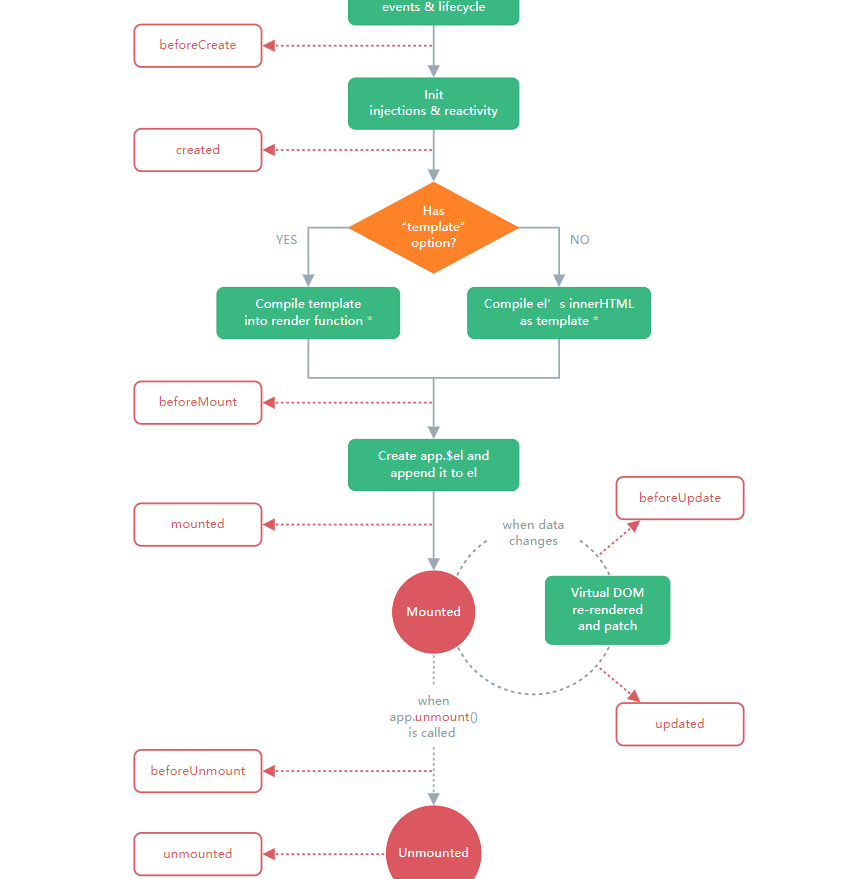
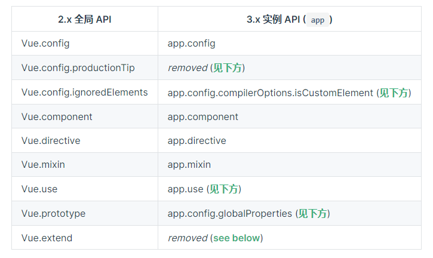
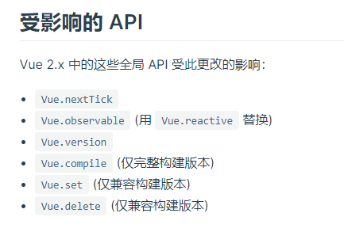

#

## vue3 的生命周期



## 组合式 API

::: info
作用：

- 解决代码可阅读性差以及可维护性差的问题
- 解决逻辑代码无法复用的问题
- 更好的支持 typeScript
  :::

```javascript
<template>
    <!-- 这里的a是从setup函数中返回出来的，虽然这个a是通过ref构造出来的，但是在只有在setup中需要使用a.value来访问值，在组件的其他地方使用直接调用其自身就可以，即写a -->
    <div>{{ a }}</div>

    <button @click="change"></button>
</template>
<script>
import { reactive, ref, toRefs, provide, readonly } from "vue";
export default {
    props: {
        testA: {
            type: String,
            default: "",
        },
    },
    //组合式API的核心方法，这个方法会在组件创建之前执行，即在beforeCreate之前执行
    setup(props, content) {
        //props是父组件传递进来的数据，如果使用解构的方式来获取其内部的数据，那么就会使props里的数据不再具有响应的特性
        let { testA } = toRefs(props); //通过toRefs这个函数，可以使数据被解构了，也能继续保有响应的特性

        //content是一个js对象，这个对象内包含slots、emit和attrs三个属性

        let a = ref([]); //通过ref的函数可以使一个自定义的数据具有响应的特性
        let b = ref("");

        a.value.push("1"); //ref的特殊性，在于要调用或者使用这个自定义数据的时候需要通过访问其value的属性来获得
        b.value = "2";

        let d = reactive([]); //也可以通过reactive的函数来使这个自定义数据具有响应的特性
        let e = reactive({
            a: "d",
            c: "e",
        });
        d.push("3"); //reactive函数构建的，直接调用就可以了，不用像ref那样
        e.a = "4";
        this;
        //因为是在组件创建之前执行的，所以这里的this指向的是undefined

        //如果setup是async...await形式的,大部分setup中只会执行第一个await(包括该await)之前的内容


        //setup返回的所有数据，可以在组件中任一处直接使用，这些数据会直接存在于组件的this中
        //也可以返回一个函数，函数内部返回由h函数渲染的标签，这个可以替换template中的内容
        return {
            a,
            b,
        };
    },
    methods: {
        change() {
            this.a; //在组件的中调用setup函数中返回的数据，需要用到this
        },
    },
};
</script>

//要注入数据的组件
<script>
import { inject } from "vue";
export default {
    setup() {
        //要注入数据的组件，通过inject来注入数据，第一参数是要注入数据的名称，第二参数给这个注入数据一个默认值
        //第二个参数是可选的
        inject("age", "12");
    },
};
</script>
```

::: info
生命周期的钩子函数：

在`setup`组合式 API 中以往的生命周期钩子函数，需要在前面加上 on 进行使用，且因为组合式 API 的调用时间是在组件创建之前，所以不再需要 beforeCreate 和 created 两个钩子，同时组合式 API 将 destroyed 和 beforeDestory 两个钩子函数转变为 onBeforeUnmount 和 onUnmount
:::


## setup 语法糖

单文件组合式 Api 的语法糖

```javascript
// 其实就是一个script中只有setup函数
<script  setup>
    const msg = '22'
</script>
<template>
     <div>{{msg}}</div>
 </template>

//渲染结果
 <div>22</div>

//实际上输出
import {h} from 'vue';
export default {
    setup(){
         const msg = '22'
         return function render(){
             return h('div',{},msg)
         }
    }
}

//使用组件
<script  setup>
    import Foo from '';
    import Tool from '';
    const msg = '22'
    const test = () => {}
</script>
<template>
    <foo :msg='msg' @test='test'></foo>
    <tool> </tool>
 </template>

//渲染结果
  <foo :msg='msg' @test='test'></foo>
  <tool> </tool>

//实际上输出
import {h} from 'vue';
import Foo from '';
import Tool from '';
export default {
    setup(){
          const msg = '22'
          const test = () => {}
         return function render(){
             return [h(Foo),{
                 msg,
                 onTest:test
             },h(Tool)]
         }
    }
}

```

### 命名空间组件

```javascript
<script setup>
import * as Form from './form-components'
</script>

<template>
  <Form.Input>
    <Form.Label>label</Form.Label>
  </Form.Input>
</template>
```

### 常用的 hook 函数

```javascript
<script setup>
import { useSlots, useAttrs,defineProps,defineEmits} from 'vue'
import { useRoute, useRouter } from 'vue-router/composables';
  // 注意hook函数只能在代码的最顶层中使用

  // 获取solts插槽对象
  const slots = useSlots()
  // 如果是在template模版中使用可以直接写$slots

  // 3.3版本也可以这样获取solt对象
  const slots = defineSlots<{
      default(props: { msg: string }): any
      }>()

  // 获取当前组件上的属性
  const attrs = useAttrs()
  // 如果是在template模版中使用可以直接写$attrs

  // 获取父组件传递进来的参数
  const props = defineProps({test:string})

  // 获取父组件传递进来的方法
  const emits = defineEmits(['change', 'delete'])
  // 使用ts时
  const emits = defineEmits<{
       (e: 'change', id: number): void
       (e: 'update', value: string): void
       }>()
  // 使用
  emits('change',value)

  // 获取路由对象
  const router = useRouter()
  // 获取路由参数对象
  const route = useRoute()

  const test = () => {
      //hook函数不可以在任意的函数 对象中初始化使用，以下是不正确的
       const slots = useSlots()
  }
</script>

// 暴漏一些方法，让外部能通过ref得到组件对象来调用
// 组件a
<script  setup>
import { defineExpose } from 'vue'

const test = () => { }

// 向外界暴漏test方法
defineExpose({
  test
});

</script>


//要调用a组件中test方法的b组件
<a ref='aRef'> </a>
<script  setup>
import { ref,onMounted} from 'vue';

const aRef = ref();

onMounted(() => {
    // 调用组件a中的test方法
    aRef.value.test()
})
</script>
```

## reactive

用于创建一个响应性对象或者数组，不能使用 reactive 创建基础类型数据，因为 reactive 使用 proxy 来对数据进行代理操作，proxy 无法操作基本类型的值

```javascript
<script setup>
import { reactive } from 'vue'
let msg = reactive({ a: '212' })
msg.a = '555'

// 重新赋值会使reactive的数据失去响应性
setTimeout(() => {
  msg = reactive({
    a: '444'
  })
  // msg不会发生改变
}, 3000)

// 解构或者将其内部的某个数据作为参数传入 也会使其失去响应性
let { a } = msg
a = '4444'

const foo = (data) => {
  data = 4
}
foo(msg.a)
// 以上情况msg中的a都不会发生改变
</script>

<template>
  <h1>{{ msg }}</h1>
</template>
```

## ref

用于创建一个有响应性的数据

```javascript
<script setup>
import { ref } from 'vue'

const count = ref(0)

function increment() {
  count.value++
}

// 这种情况ref会失去响应性
let msg = ref('333')
const foo = (data) => {
  data = 4
}
setTimeout(() => {
 foo(msg.value)
}, 3000)
</script>

<template>
  <button @click="increment">
    {{ count }}
  </button>
</template>
```

本质上 ref 是 reactive 的高阶函数，可以简单的看作是一个有 value 属性值的 reactvie 对象

```javascript
// 大致的实现逻辑
function ref(value) {
  // 创建一个内含.value属性的响应式对象
  const refObject = {
    get value() {
      track(refObject, 'get', 'value')
      return value
    },
    set value(newValue) {
      if (newValue !== value) {
        value = newValue
        trigger(refObject, 'set', 'value')
      }
    },
  }

  return reactive(refObject)
}

function reactive(target) {
  // 用Proxy实现基本的响应式
  return new Proxy(target, {
    get(target, prop) {
      // 收集依赖...
      return Reflect.get(target, prop)
    },
    set(target, prop, value) {
      // 触发更新...
      return Reflect.set(target, prop, value)
    },
  })
}

function track() {
  // 依赖收集相关逻辑
}

function trigger() {
  // 触发更新相关逻辑
}
```

## computed 计算属性

一个只读的计算属性

```javascript
const count = ref(1)
const plusOne = computed(() => count.value + 1)
// computed返回的是ref包裹后的对象，所以在使用的时候需要用.value访问

console.log(plusOne.value) // 2

plusOne.value++ // 错误
```

一个可写的计算属性

```javascript
const count = ref(1)
const plusOne = computed({
  get: () => count.value + 1,
  set: (val) => {
    count.value = val - 1
  },
})

plusOne.value = 1
console.log(count.value) // 0
```

计算属性的调试

```javascript
const plusOne = computed(() => count.value + 1, {
  onTrack(e) {
    // 当 count.value 被追踪为依赖时触发
    debugger
  },
  onTrigger(e) {
    // 当 count.value 被更改时触发
    debugger
  },
})

// 访问 plusOne，会触发 onTrack
console.log(plusOne.value)

// 更改 count.value，应该会触发 onTrigger
count.value++
```

::: tip
3.4 版本后，computed 只会在新旧两个值不一样时才会只会执行后续的操作
:::

## readonly

是某些数据只读

```javascript
const original = reactive({ count: 0 })

const copy = readonly(original)

watchEffect(() => {
  // 用来做响应性追踪
  console.log(copy.count)
})

// 更改源属性会触发其依赖的侦听器
original.count++

// 更改该只读副本将会失败，并会得到一个警告
copy.count++ // warning!
```

## 侦听器

监听某些数据的改变，然后执行对应的操作

### watch 侦听器

监听不同来源的数据

```javascript
const x = ref(0)
const y = ref(0)

// 单个 ref
watch(x, (newX) => {
  console.log(`x is ${newX}`)
})

// getter 函数
watch(
  () => x.value + y.value,
  (sum) => {
    console.log(`sum of x + y is: ${sum}`)
  }
)

// 多个来源组成的数组
watch([x, () => y.value], ([newX, newY]) => {
  console.log(`x is ${newX} and y is ${newY}`)
})
```

不能直接去侦听响应性对象的属性值，而是应该改成计算属性来侦听

```javascript
const obj = reactive({ count: 0 })

// 错误，因为 watch() 得到的参数是一个 number
watch(obj.count, (count) => {
  console.log(`count is: ${count}`)
})

// 提供一个 getter 函数
watch(
  () => obj.count,
  (count) => {
    console.log(`count is: ${count}`)
  }
)
```

深层的侦听对象 即时回调侦听 一次性侦听 侦听回调执行的时机和调式

```javascript
watch(
  () => state.someObject,
  (newValue, oldValue) => {
    // 注意：`newValue` 此处和 `oldValue` 是相等的
    // *除非* state.someObject 被整个替换了
  },
  { deep: true }
)
watch(
  source,
  (newValue, oldValue) => {
    // 立即执行，且当 `source` 改变时再次执行
  },
  { immediate: true }
)

// 3.4版本可用，当数据变化后，只触发一次
watch(
  source,
  (newValue, oldValue) => {
    // 当 `source` 变化时，仅触发一次
  },
  { once: true }
)

// 侦听回调执行的时机和调式
watch(source, callback, {
  flush: 'post', // 两个值 post代表在dom更新后执行回调函数，sync代表在数据改变的同时触发回调函数
  onTrack(e) {
    debugger
  },
  onTrigger(e) {
    debugger
  },
})
```

### watchEffect 侦听器

自动根据回调函数内部的中的响应性数据来执行回调，无需明确的指明哪些数据发生改变后，执行回调函数

```javascript
const todoId = ref(1)
const data = ref(null)

watch(
  todoId,
  async () => {
    const response = await fetch(
      `https://jsonplaceholder.typicode.com/todos/${todoId.value}`
    )
    data.value = await response.json()
  },
  { immediate: true }
)
// 上面的可以改写为watchEffect 代码更简洁
watchEffect(async () => {
  const response = await fetch(
    `https://jsonplaceholder.typicode.com/todos/${todoId.value}`
  )
  data.value = await response.json()
})
```

### watchPostEffect 侦听器

在 vue 更新后执行回调函数

```javascript
import { watchPostEffect } from 'vue'

watchPostEffect(() => {
  /* 在 Vue 更新后执行 */
})
```

### watchSyncEffect 侦听器

在响应式数据变化时同步执行

```javascript
import { watchSyncEffect } from 'vue'

watchSyncEffect(() => {
  /* 在响应式数据变化时同步执行 */
})
```

### 停止侦听

```javascript
// 上述的所有侦听器都能这么停止
const stop = watchEffect(() => {})

// 当不再需要此侦听器时:
stop()
```

## 判断响应类型的方法

可以得到各个响应数据的类型

```javascript
let foo: unknown
if (isRef(foo)) {
  // foo 的类型被收窄为了 Ref<unknown>
  foo.value
}

// isProxy() 检查一个对象是否是由 reactive()、readonly()、shallowReactive() 或 shallowReadonly() 创建的代理
function isProxy(value: unknown): boolean

// isReactive() 检查一个对象是否是由 reactive() 或 shallowReactive() 创建的代理
function isReactive(value: unknown): boolean
```

## unref

如果参数是 ref，则返回内部值，否则返回参数本身。这是 val = isRef(val) ? val.value : val 计算的一个语法糖

```javascript
function useFoo(x: number | Ref<number>) {
  const unwrapped = unref(x)
  // unwrapped 现在保证为 number 类型
}
```

## toRef

可以将值、refs 或 getters 规范化为 refs

```javascript
const state = reactive({
  foo: 1,
  bar: 2,
})

// 双向 ref，会与源属性同步
const fooRef = toRef(state, 'foo')

// 更改该 ref 会更新源属性
fooRef.value++
console.log(state.foo) // 2

// 更改源属性也会更新该 ref
state.foo++
console.log(fooRef.value)

// 3.3版本可以使computed转换为ref形式
toRef(() => props.foo)
```

## toValue

3.3 版本可以使用，将值、refs 或 getters 规范化为值。这与 unref() 类似，不同的是此函数也会规范化 getter 函数。如果参数是一个 getter，它将会被调用并且返回它的返回值

```javascript
toValue(1) //       --> 1
toValue(ref(1)) //  --> 1
toValue(() => 1) // --> 1
```

## toRefs

将一个响应式对象转换为一个普通对象，这个普通对象的每个属性都是指向源对象相应属性的 ref。每个单独的 ref 都是使用 toRef() 创建的

```javascript
const state = reactive({
  foo: 1,
  bar: 2,
})

const stateAsRefs = toRefs(state)
/*
stateAsRefs 的类型：{
  foo: Ref<number>,
  bar: Ref<number>
}
*/

// 这个 ref 和源属性已经“链接上了”
state.foo++
console.log(stateAsRefs.foo.value) // 2

stateAsRefs.foo.value++
console.log(state.foo) // 3

// 也可以用在props上使props解构出来的数据依旧具有响应性
const props = defineProps()
const [count] = toRefs(props)
console.log(count.value)
```

## v-model

### 基础使用方式

```javascript
<script setup>

// 定义 props，modelValue 是 v-model 默认使用的 prop
const props = defineProps({
  modelValue: String // 或者另一个适当的类型
})

// 定义 emits，包括 v-model 更新的事件
const emit = defineEmits(['update:modelValue'])
</script>
```

### 自定义多变量名方式

```javascript
//父组件
<template>
  <!-- 不在使用.sync修饰符，而是采用v-model：变量名的方式来替代 -->
 <children v-model:testA="testA"  v-model:testB="testB"></children>
</template>
<script setup>
 const testA = 'a';
 const testB = 'b'
</script>

//子组件
template>
    <div>{{ testA }}</div>
    <div>{{ testB }}</div>
</template>
<script setup>

const props = defineProps({
  testA: String // 或者另一个适当的类型
  testB: String // 或者另一个适当的类型
})
const emit = defineEmits(['update:testA','update:testB'])
</script>
```

### 修饰符

::: info
`v-model`自带有一些修饰符，这些修饰符可以帮助我们快速的处理数据。

- `v-model.trim`:将绑定的值的首尾空格全部自动去掉。
- `v-model.lazy`：在值发生改变的时候，让改变的事件延迟执行，例如 input 标签的 change 事件，值发生改变时只会在按下回车键或者失去了焦点后触发。
- `v-modde.number`：将绑定的值转变为数字，前提是绑定的值能被 parseFloat()方法解析。
  :::

### v-model 的自定义修饰符

```javascript
// 不带变量的v-model的方式
// 父组件
<template>
 <MyComponent v-model.capitalize="myText" />
</template>

// 子组件
<script setup>
const props = defineProps({
  modelValue: String,
  modelModifiers: { default: () => ({}) }
})

const emit = defineEmits(['update:modelValue'])

function emitValue(e) {
  let value = e.target.value
  if (props.modelModifiers.capitalize) {
    value = value.charAt(0).toUpperCase() + value.slice(1)
  }
  emit('update:modelValue', value)
}
</script>

<template>
  <input type="text" :value="modelValue" @input="emitValue" />
</template>


// 带变量的v-model的方式
// 父组件
<UserName
  v-model:first-name.capitalize="first"
  v-model:last-name.uppercase="last"
/>

// 子组件
<script setup>
const props = defineProps({
firstName: String,
lastName: String,
firstNameModifiers: { default: () => ({}) },
lastNameModifiers: { default: () => ({}) }
})
defineEmits(['update:firstName', 'update:lastName'])

console.log(props.firstNameModifiers) // { capitalize: true }
console.log(props.lastNameModifiers) // { uppercase: true}
</script>
```

### defineModel

3.4 版本以后可以使用，v-model 的语法糖

```javascript
// 父组件
<Child v-model="count" />

// 子组件
<script setup>
// 返回的是一个ref对象
const model = defineModel({type:number,required: true,default:0})

function update() {
  model.value++
}
</script>

<template>
  <input v-model="model" />
</template>


// 有参数的时候
// 父组件
<MyComponent v-model:title="bookTitle" />

// 子组件
<script setup>
const title = defineModel('title')
// 或者写成
const title = defineModel('title', { required: true })
</script>

<template>
  <input type="text" v-model="title" />
</template>

// 多个参数的时候
// 父组件
<UserName
  v-model:first-name="first"
  v-model:last-name="last"
/>

// 子组件
<script setup>
const firstName = defineModel('firstName')
const lastName = defineModel('lastName')
</script>

<template>
  <input type="text" v-model="firstName" />
  <input type="text" v-model="lastName" />
</template>


// 处理自定义修饰符
// 父组件
<MyComponent v-model.capitalize="myText" />

// 子组件
<script setup>
const [model, modifiers] = defineModel({
  set(value) {
    // 改变model时触发
    if (modifiers.capitalize) {
      return value.charAt(0).toUpperCase() + value.slice(1)
    }
    return value
  },
  get(value){
    // 获取model时触发
    return value

  }
})
</script>

<template>
  <input type="text" v-model="model" />
</template>

// 多参数的修饰符操作
// 父组件
<UserName
  v-model:first-name.capitalize="first"
  v-model:last-name.uppercase="last"
/>

// 子组件
<script setup>
const [firstName, firstNameModifiers] = defineModel('firstName')
const [lastName, lastNameModifiers] = defineModel('lastName')

console.log(firstNameModifiers) // { capitalize: true }
console.log(lastNameModifiers) // { uppercase: true}
</script>

```

## $attrs 的变化和 defineOptions

vue3 中移除$listener对象，并将其融合进$attrs 对象中，同时将 class 和 style 上的内容融合进$attrs 中

```javascript
//父组件
<template>
    <div class="home" id="home">
        <test-slot id='test'  @test='testChange' class="my-class" style='color:red'>

        </test-slot>
    </div>
</template>

<script>
import TestSlot from "./components/test-slots";
export default {
    components: {
        TestSlot,
    },
    data(){
        return {
            test:'22'
        }
    }

};
</script>

//vue2对应的子组件
//插槽组件
<template>
    <div>
     //虽然写了inheritAttrs：false,但是传入的class和style依旧由根组件继承
     //这里div变为<div class=’my-class‘ style="color:red">
      <p v-bind='$attrs' v-on='$listeners'></P>
       //这里p变为 <p id='test'  @test='testChange'></p>
       //$attrs为{id:'22'}
       //$listeners为{onTest:testChange},注意v-on绑定的方法前面都会加上on,注意这里的testChange指的是父组件传入的那个方法
    </div>
</template>
<script>
import { onMounted } from '@vue/runtime-core'
export default {
    inheritAttrs:false
}
</script>

//vue3对应的子组件
//插槽组件
<template>
    <div>
      <p v-bind='$attrs'></P>
       //这里p变为 <p id='test'  @test='testChange' class="my-class" style= "color:red" ></p>
       //$attrs为{id:'22',onTest:testChange,class:'my-class',style:{color:'red'}}

    </div>
</template>

// 3.3 版本以前无法在setup语法糖内这么写，只能是分开写
<script>
import { onMounted } from '@vue/runtime-core'
export default {
    inheritAttrs:false
}
</script>
<script setup>

</script>

// 3.3版本可以使用defineOtions来进行操作
<script setup>
defineOptions({
  inheritAttrs: false,
  customOptions: {
    /* ... */
  }
})
</script>

```

## shallowRef

和 ref 不同，浅层 ref 的内部值将会原样存储和暴露，并且不会被深层递归地转为响应式。只有对 .value 的访问是响应式的

```javascript
const state = shallowRef({ count: 1 })

// 不会触发更改
state.value.count = 2

// 会触发更改
state.value = { count: 2 }
```

## triggerRef

强制触发依赖于一个浅层 ref 的副作用，这通常在对浅引用的内部值进行深度变更后使用

```javascript
const shallow = shallowRef({
  greet: 'Hello, world',
})

// 触发该副作用第一次应该会打印 "Hello, world"
watchEffect(() => {
  console.log(shallow.value.greet)
})

// 这次变更不应触发副作用，因为这个 ref 是浅层的
shallow.value.greet = 'Hello, universe'

// 打印 "Hello, universe"
triggerRef(shallow)
```

## customRef

创建一个自定义的 ref，显式声明对其依赖追踪和更新触发的控制方式

```javascript
import { customRef } from 'vue'

export function useDebouncedRef(value, delay = 200) {
  let timeout
  return customRef((track, trigger) => {
    return {
      get() {
        track()
        return value
      },
      set(newValue) {
        clearTimeout(timeout)
        timeout = setTimeout(() => {
          value = newValue
          trigger()
        }, delay)
      }
    }
  })
}


// 使用
<script setup>
import { useDebouncedRef } from './debouncedRef'
const text = useDebouncedRef('hello')
</script>

<template>
  <input v-model="text" />
</template>
```

## shallowReactive

reactive 的浅层作用，只对 reactive 根级别的属性有响应性

```javascript
const state = shallowReactive({
  foo: 1,
  nested: {
    bar: 2,
  },
})

// 更改状态自身的属性是响应式的
state.foo++

// ...但下层嵌套对象不会被转为响应式
isReactive(state.nested) // false

// 不是响应式的
state.nested.bar++
```

## shallowReadonly

readonly 的浅层作用

```javascript
const state = shallowReadonly({
  foo: 1,
  nested: {
    bar: 2,
  },
})

// 更改状态自身的属性会失败
state.foo++

// ...但可以更改下层嵌套对象
isReadonly(state.nested) // false

// 这是可以通过的
state.nested.bar++
```

## toRaw

返回一个响应性对象的源对象，不建议保存对源对象的持久引用，请谨慎使用

```javascript
const foo = {}
const reactiveFoo = reactive(foo)

console.log(toRaw(reactiveFoo) === foo) // true
```

## markRaw

将一个对象标记为“原始”对象，这意味着 Vue 响应式系统会跳过这个对象，不会对其进行代理或响应式变换。这对于优化性能或与第三方库集成时尤其有用

```javascript
import { markRaw, reactive } from 'vue'

let myObject = {
  complex: new ComplexLibraryInstance(),
}

// 标记这个对象或实例为原始的
myObject.complex = markRaw(myObject.complex)

// 现在，即使包裹在 reactive 内，Vue 也不会尝试使 complex 属性成为响应式
const state = reactive(myObject)

// state.complex 是一个非响应式的原始对象
console.log(state.complex) // 将直接输出原始的 ComplexLibraryInstance 实例
```

::: tip
使用 markRaw 是一种性能优化手段，因为它让你能够避免把不需要的对象转换为响应式对象，这可以减少内存的占用和初始化响应式转换的开销
但是一旦对象被 markRaw 标记，它及其包含的所有嵌套对象都不会再被 Vue 转换为响应式对象，因此在使用 markRaw 时需要谨慎考虑
:::

## effectScope

用于提供一个可以控制多个响应式副作用（如 watch 和 computed）生命周期的作用域

每当你创建一个 watch、computed 或任何基于 effect（如 reactive 或 ref）的响应式响应，它实际上都是一个副作用。在没有 effectScope 的情况下，管理这些副作用的生命周期可能会比较困难，特别是当有很多副作用需要一起停止时

effectScope 允许你将这些副作用组织到一个可管理的作用域内。当作用域被停止（调用其 stop 方法）时，它内部所有的副作用都会一起停止。这很有用，比如当你的组件被卸载时，你可能想要清除所有的响应式副作用，以便它们不会继续监听变化并触发更新，以此避免潜在的内存泄漏

```javascript
import { effectScope, reactive, ref, watch } from 'vue'

const scope = effectScope()

scope.run(() => {
  // reactive state
  const state = reactive({ count: 0 })

  // computed value
  const doubled = computed(() => state.count * 2)

  // watch effect
  watch(doubled, (newVal) => {
    console.log('Doubled value is now:', newVal)
  })

  // everything created in here is part of the effect scope
})

// 在组件卸载时停止作用域
onUnmounted(() => {
  scope.stop()
  // state、doubled 和 watch 都在由 effectScope 创建的作用域内部运行。在调用 scope.stop() 之后，所有的响应式连接（包括 watch 和 computed）都会被停止
})
```

## getCurrentScope 和 onScopeDispose

getCurrentScope 用于返回当前活跃的 effect 作用域，onScopeDispose 用于当 effect 作用域停止时，执行回调函数，可以作为 onUnmounted 的替代品，因为一个 Vue 组件的 setup() 函数也是在一个 effect 作用域中调用的

```javascript
import { effectScope, getCurrentScope, onScopeDispose } from 'vue'

// 在 setup 函数外创建一个新的作用域
const scope = effectScope()

// 激活作用域
scope.run(() => {
  // ...定义响应式状态和副作用

  // 在 setup 函数内或一个 effectScope 的回调内
  // 获取当前活动的作用域
  const currentScope = getCurrentScope()

  // 使用 onScopeDispose 注册一个回调，当作用域停止时执行
  onScopeDispose(() => {
    console.log('Current scope is being disposed!')
  })

  // 测试 currentScope 和 scope 是否相同
  console.log('Scopes are equal:', currentScope === scope)
})
```

## provide 和 inject

```javascript
<template>
    <children></children>
</template>

<script lang="ts">
import { ref, defineComponent, provide } from "vue";
import children from "./components/children";

export default defineComponent({
    name: "Home",
    components: {
        children,
    },
    //传递写法一
    provide() {
        return {
            school: "22",
        };
    },
    setup() {
        // 传递写法二
        provide("name", "ly"); //传入两个值，第一个要传递数据的名称，第二个值是要传递是数据的值
        let age = ref("");
        provide("age", age); //如果要使传递的数据具有响应的特性，那么传入的值需要通过ref或者reactive包装

        const changeAge = (age) => {
            //要修改传递的数据的值，建议在源头提供修改这个数值的方法，并通过provide传递下去
            age.value = age;
        };
        provide("changeAge", changeAge);

        let e = ref(0);
        provide("e", readonly(e)); //通过readonly就可以保证传递的数组不会被引用这些数据的组件所改变

        return {};
    },
});
</script>

//在children组件中
<template>
</template>
<script lang="ts">
import { defineComponent, inject } from "vue";
export default defineComponent({
    //注入写法一
    inject:['name'],
    // 注入写法二
    inject: {
        reName: {
            //获取到传递的name属性，并将其重名为reName
            from: "name",
        },
    },

    setup() {
        //注入写法三
        // re就是传递的age值
        let re = inject("age", "555");
    },

});
</script>
```

## teleport 引入模板

::: tip

- 可以使组件的一部分 html 代码放置另一处执行，但与此部分有关的 js 代码仍然可以在当前组件内编写；

- teleport 注入（或者说 to 指向）的地方不能是当前组件的父组件或者子组件
  :::

```javascript
<template>
    <div>
     <!-- teleport组件 -->
    <!-- to是DOM获取器 -->
        <teleport to="#TestTeleport">
            <button @click="tipTest = true">开启提示文字</button>
            <div v-if="tipTest">
                <p>提示文字</p>
            </div>
        </teleport>
    </div>
</template>
<script>
import {
    ref,
} from "vue";
export default {
    setup(props, content) {
        //与teleport有关的代码仍然可以在当前组件编写
        let tipTest = ref(false);
        return {
            tipTest,
        };
    },
};
</script>
```

```javascript
<template>

  <!-- teleport注入组件 -->
  <test></test>
 <!-- 引用teleport组件 -->
  <children></children>
</template>
<script>
import children from "./about/index";
import Test from './about/test.vue';
export default {
   components:{
     children,
     Test
   },
}
</script>
```

```javascript
<template>
     <!-- teleport注入组件 -->
     <div id="TestTeleport"></div>
</template>
<script>
export default {

}
```

## emits 事件注册（不使用 setup 语法糖的情况）

在 vue3 中使用`$emit`所触发的事件需要在 emits 对象中注册管理，不然程序就会弹出警告

```javascript
//父组件
<template>
 <children  @test="testA"></children>
</template>
<script>
import children from "./about/index";
export default {
    components: {
        children,
    },
    data(){
        return {

        }
    },
    methods:{
        testA(){
            console.log(34534)
        }
    }
};
</script>

//子组件
<template>
   <button @click="change">123412</button>
</template>
<script>
export default {
    //emits的两种写法，数组写法的是无法对参数进行验证的，对象写法是可以对参数进行验证的
    //无论是对象还是数组写法，最终都是会把事件执行的，emits的作用只是记录当前组件所用的emit事件
    // emits:['test'],
    emits:{
        //原生事件不需要验证参数
        click:null,
        //自定义事件可以验证参数
        test(value){
            //对传入的参数进行验证
            //无论返回的是true还是false，事情最终还是会被执行
            if(value instanceof String){
                return true;
            }else{
                return false
            }

        }
    },
    methods:{
     change(){
         this.$emit('test',1)
     }
    },
    mounted() {

    },
};
</script>
```

## vue3 中使用 css 变量和使用全局选择器、插槽选择器和深入选择器

```javascript
//父组件
<template>
    <children :testA="testA">
        <template v-slot:head>
            <p class="testB">333</p>
        </template>
        <template v-slot:foot="{ testName }">
          <p class="testC">{{ testName }} <span>222</span></p>
         </template>
    </children>
</template>
<script>
import children from "./about/index";
export default {
    components: {
        children,
    },
    data() {
        return {
            testA: "a",
            testB: "b",
        };
    },
};
</script>

//子组件
<template>
    <div class="test">
        222
        <slot name="head"></slot>
        <slot name="foot" :testName="testName"></slot>
    </div>
    <button @click="change">222</button>
</template>
<script>
export default {
    props: ["testA"],
    data() {
        return {
            // vue3中的css变量的写法,可以在data中定义css变量
            color: "red",
            font: {
                size: "50px",
            },
            testName: "444",
        };
    },
    methods: {
        //可以通过方法动态的改变值，同时改变css样式
        change() {
            this.color = "green";
            this.font.size = "20px";
        },
    },
};
</script>

<style lang="less" scoped>
.test {
    //在css中通过v-bind（变量名）的方式来获取
    color: v-bind(color);
    font-size: v-bind("font.size");
    //深度选择器,就是可以穿透来给与class值
    ::v-deep(.testB) {
        color: black;
    }
    //深度选择器的简写
    :deep(.testB) {
        font-size: 18px;
        color: black;
    }
    //插槽选择器,vue3中插槽内部标签的样式不在能够直接在子组件中编写，需要用到插槽选择器
    ::v-slotted(.testC) {
        font-size: 30px;
        color: blue;
        span {
            color: brown;
        }
    }
    //插槽选择器的简写
    :slotted(.testC) {
        font-size: 30px;
        color: blue;
        span {
            color: brown;
        }
    };
    //全局选择器，现在可以在组件内部中获取到全局的一些样式
    ::v-global(.testD){
        font-size: 23px;
    };
    //全局选择器的简写
    :global(.testD){
        font-size: 23px;
    }

}
</style>
```

## vue3 中异步引入组件

```javascript
<template>
    <define-component :testA="testA"> </define-component>
</template>
<script>
import { defineAsyncComponent } from "@vue/runtime-core";
import { onMounted } from "vue";
//普通异步组件写法
const defineComponent = defineAsyncComponent(()=>import('./about/index.vue'));
//其实异步组件的函数写法，是需要返回一个promise对象，且用resolve来包裹引用的vue组件
const defineComponent = defineAsyncComponent(()=>new Promise((resolve, reject) => {
      resolve('./about/index.vue')
    }));
//对象写法异步组件的写法
const defineComponent = defineAsyncComponent({
    // 工厂函数
    loader: () => import("./about/index.vue"),
    // 加载异步组件时要使用的组件
    loadingComponent: LoadingComponent,
    // 加载失败时要使用的组件
    errorComponent: ErrorComponent,
    // 在显示 loadingComponent 之前的延迟 | 默认值：200（单位 ms）
    delay: 200,
    // 如果提供了 timeout ，并且加载组件的时间超过了设定值，将显示错误组件
    // 默认值：Infinity（即永不超时，单位 ms）
    timeout: 3000,
    // 定义组件是否可挂起 | 默认值：true, 这个很重要，设为false，以上配置才会生效
    suspensible: false,
    /**
     *
     * @param {*} error 错误信息对象
     * @param {*} retry 一个函数，用于指示当 promise 加载器 reject 时，加载器是否应该重试
     * @param {*} fail  一个函数，指示加载程序结束退出
     * @param {*} attempts 允许的最大重试次数
     */
    //错误尝试函数
    onError(error, retry, fail, attempts) {
        if (error.message.match(/fetch/) && attempts <= 3) {
            // 请求发生错误时重试，最多可尝试 3 次
            retry();
        } else {
            // 注意，retry/fail 就像 promise 的 resolve/reject 一样：
            // 必须调用其中一个才能继续错误处理。
            fail();
        }
    },
});
export default {
    components: {
        defineComponent,
    },
    data() {
        return {
            testA: "a",
            testB: "b",
        };
    },
    setup() {
        onMounted(() => {
            console.log(defineComponent, 888);
        });
    },
};
</script>
```

## vue3 中的原生 DOM 对象获取

```javascript
<template>
    <!-- ref用于v-for循环创建的对象上，需要用v-bind进行绑定,且绑定的是一个函数-->
    <div v-for="item in domList" :key="item" :ref="refListDom">{{item}}</div>
    <!-- ref用于标签和组件上时不需要v-bind进行绑定 -->
    <div ref="refDom">111</div>

</template>
<script>
import { ref, onMounted } from "vue";
export default {
    props: ["testA"],

    setup() {
        let domList = ref(["333", "444"]);
        //不在v-for中使用ref
         const refDom =ref(null);
        //在v-for中使用ref，并将获取到的dom装入数组中
         const tempDomList = ref([]);
         //在v-for中使用ref，并将获取到的dom装入对象中
         const tempDomObj = ref({});
        // 循环装入Dom对象
        const refListDom =(el) => {
            tempDomList.value.push(el);
            tempDomObj.value[el.innerTetx] = el;
        }
        return {
            domList,
            refDom,
            refListDom

        };
    },
};
</script>

```

## vue3 中创建 vue 实例

```javascript
//vue3中创建一个vue实例不再使用以下方法
let app = new Vue();
//而是采用从vue包中导出的createApp方法
import {createApp} from 'vue'
let app = createApp({}) //这样就得到一个空的vue实例
app.monut('#app') //手动进行vue的创建和挂载到id为app的标签上

//也可以传入一个vue组件，通过这个组件来实例化一个vue
import test from 'test.vue';
import {createApp} from 'vue'
let testVue = createApp(test); //根据test组件构建vue实例
testVue.mount('#app',{    //创建testVue组件
    //createApp的第二个参数，是相当于给这个组件的props传递值
    name:'22';
})
//在test.vue中
export default {
    props:['name'] //接受createApp第二个参数传递的值
}
```

## Vue3 全局 api(会改变 vue 行为的)

Vue.config.ignoreElements 替换为 app.config.compilerOptions.isCustomElement

```javascript
//当你在vue中写了自定义的html标签，但是又没有把其当做是组件，那么就需要Vue.config.ignoreElements来表明，不然vue就会报错
;<template>
  <my></my>
</template>
//上面的my标签没有定义在components中，那么vue就会报错
//加上下面这个就不会报错
Vue.config.ignoreElements = ['my']

//vue3需要在主入口文件中
app.config.compilerOptions.isCustomElement = (tag) => tag === 'my' //这个app就是我们在入口中创建的vue实例
```

Vue.prototype 替换为 app.config.globalproterties

```javascript
//Vue.prototype 用于你想全局的定义一个变量、常量、方法等
Vue.prototype.$test = '22';
//在不同的vue文件中都可以获取到
//test1.vue中
export default {
    methods:{
        change(){
            this.$test //得到22
        }
    }
}
//test2.vue中
import Vue from 'vue';
export default {
    methods:{
        change(){
           this.$test //得到22
        }
    }
}
//如果是在js文件中的话
import Vue from 'vue';
Vue.prototype.$test //得到22

//在vue3中需要在主入口文件中
import { createApp } from 'vue'
import App from './App.vue'
import router from './router'
import store from './store'
let app = createApp(App);
app.config.globalProperties.$Test = '22'; //定义一个全局的$Test
app.use(router);
app.use(store);
app.mount('#app');
//在.vue文件中
import { getCurrentInstance } from "vue";
export default {
    setup() {
        //使用需要借助getCurrentInstance获取到入口处的app实例
       const { proxy } = getCurrentInstance()
        console.log(proxy.$Test)
    },
}

//但是在vue3中一般使用provide和inject代替app.config.properties
import { createApp } from 'vue'
import App from './App.vue'
import router from './router'
import store from './store'
let app = createApp(App);
app.provide('$Test','22') //定义一个全局的$Test
app.use(router);
app.use(store);
app.mount('#app');
//在.vue文件中
export default {
    setup() {
      let test =  inject('$Test')

    },
}

```

废弃掉 Vue.extend(),改用 createApp()进行代替

```javascript
//以前根据已有的vue文件实例化一个vue，进行挂载，并传递值的方法
import test from 'test.vue'
let vue = Vue.extend(test)
new vue({
  //propsData相当于往props中传递了test值
  propsData: {
    test: '2',
  },
}).mount('#app')

//Vue3中
import test from 'test.vue'
import { createApp } from 'vue'

let app = createApp(test, {
  test: '22',
})
app.mount('#app')
```

Vue.componentv、Vue.mixin 和 Vue.directive 替换为 app.component、app.mixin 和 app.directive

```javascript
//只演示一种
import { createApp } from 'vue'
import App from './App.vue'
import router from './router'
import store from './store'
let app = createApp(App)
//注册全局组件
app.component('组件名', {})

app.use(router)
app.use(store)
app.mount('#app')
```



## vue3 全局 Api（不会改变 vue 行为的）

只演示下图中 nextTick 的变化，其他的都一样

```javascript
//在以前中，想在在dom更新渲染完毕后执行一些方法
export default {
methods:{
  chnage(){
    //这样表明，不管你有没有用到$nextTick方法，它都绑定在vue身上，这样打包的体积就慢慢变大
    this.$nextTick(()=>{
    })
  }
 }
}

//在vue3中通过显式的引入获取nextTick方法，这样只在有需要的时候引用它，没必要全部的vue实例中都有它
import {nextTick} from 'vue';
setup(){
    nextTick(()=>{

    })
}
```



## template 中的变化

template 上可以使用 v-for，且绑定的 key 值也应该写在 template 上，同时 v-if v-else-if v-else 上不需要在绑定 key 值

```javascript
<template v-for="(item,index) in list" :key="index">
    <div></div>
    <div></div>
 </template>
export default {
    setup(){
        return {
            list:ref([1,2,3])
        }
    }
}
```

v-for 和 v-if 的优先级发生改变

```javascript
//在vue2.x中 v-for的优先级比v-if的高，即会先循环创建再判断if
<template v-for="(item,index) in list" :key="index">
    <div v-if='item'></div>
    <div></div>
 </template>

//在vue3.x中 v-if的优先级比v-for的高，会先判断if，然后再根据结果，循环渲染那些需要展示的dom
<template v-for="(item,index) in list" :key="index">
    <div v-if='item'></div>
    <div></div>
 </template>


```

单数据绑定和 v-bind 绑定的顺序

```javascript
//在vue2.x中
  <div :id='red' v-bind='{id:blue}'></div>
//得到的结果
<div :id = 'red'></div> //在vue2中不管单数据是写在v-bind后面还在前面，都会替代v-bind中同名的属性

//在vue3中
<div :id='red' v-bind='{id:blue}'></div>
//得到的结果
<div :id = 'blue'></div> //在vue3中根据单数据和v-bind谁在后面，谁就替代谁

```

移除 v-on:click.native 的 native 修饰符，替换为 emits

```javascript
//当你要在自定义组件上定义dom原生的click等事件，需要.native修饰符
<my @click.native='test'></my>

//但是在vue3中不再需要
<my @click.native='test'></my>
//在my.vue文件中
export default {
  emit:{
    click:null,
  }
}
```

## vue3 的渲染函数 render 和 h 函数

vue 的渲染过程为 **template 解析** => **AST 语法树生成（就是用一个 js 对象表示整个 DOM 树）**=> render**函数渲染** => **vnode 节点生成**

```javascript
//render函数用于将一个vue文件渲染为虚拟节点（vnode）,所谓的虚拟节点其实就是对dom节点的解释，包括节点是什么标签，标签内容是什么，标上的class等属性是什么
//h函数在vue2中是render函数中默认带有的参数，但是在vue3中则需要通过手动引入来获得，h函数实际上是一个createElement函数，即创建一个节点的函数

//在vue2中render函数，第一个参数为h，第二个参数是一个对象，对象内有props、data和children
let vue2Render = Vue.extend({
    render(h,{props,data,children}){
        //props即从外部传入的数据
        //data即组件上的属性，例如我们创建<vu2 class='test' id='2'></vue2>,data就是{class:'test',id:'2'}

        //h函数接受3个参数，第一个参数是要渲染成什么标签，第二个是标签上有什么属性，第三个是标签的内容是什么，可以是一个数组，内容按数组内的顺序，依次渲染
        return h('h'+props.test,{
            attrs:{
                id;'2'
            }
        },['22',h('p',{},'测试')])

        //如果传进来的test是4，那么以上就得到如下的vue文件
        //<tempalte>
        //<h4 id = '2'>22
        //<p>测试</P>
        //</h4>
        //</template>
        //<script>export default{ props:['test']}
        //</script>

       //在render中this指向着当前的vue文件，即我们extend创建的vue实例，所以上面的h函数也可以写为
        return h('h'+this.test,{
            attrs:{
                id;'2'
            }
        },['22',h('p',{},'测试')])


        //也可以返回一个数组，表示渲染多个根标签
        return [h('div','22'),h('p','66')];
        //最终得到的渲染
        //<tempalte>
        //<div>22</div>
        //<p>66</P>
        //</template>
    },
    props:['test']
})

//在vue3中render函数不再默认的传入h函数，需要手动的显式引入h函数，
//render函数接受的参数变为props和content，content中包含attrs、emit和slots
//但是一般不使用这些参数，而是直接通过this来调用内容
import {createApp,h} from 'vue';
let vu3Render = createApp({
    render(props,{attrs,slots,emit}){
       return h('h'+this.test,{
            attrs:{
                id;'2'
            }
        },['22',h('p',{},'测试')])

    },
    props:['test']
})

//h函数渲染已有的组件
//渲染局部组件
import test from '';
export default {
    components:{
        test
    }
    mounted(){
        //vue2
        let vue2 = Vue.extend({
            c
        });
        //vue3
        let vue3 = createApp({
            render(){
                return h(test)
            }
        })

    }
}

//渲染全局组件
//vue2
Vue.component('test',{

});
//在某一个vue文件中
export default {
     mounted(){
         Vue.extend({
             render(h){
                 //全局使用时，传入字符串形式的组件名
                 return h('test')
             }
         })
     }
}

//vue3
app.component('test',{})
//在某一个vue文件中
import {createApp,resolveComponent} from 'vue'
export default {
     setup(){
         Vue.extend({
             render(h){
                 //全局使用时，需要借助resolveComponent解析组件名
                 return h(resolveComponent('test'))
             }
         })
     }
}

//h函数的第二个参数能填入的数据列表，就是直接赋给标签的属性
{
 // 和`v-bind:class`一样的 API
 'class': {
  foo: true,
  bar: false
 },
 // 和`v-bind:style`一样的 API
 style: {
  color: 'red',
  fontSize: '14px'
 },
 // 正常的 HTML 特性
 attrs: {
  id: 'foo'
 },
 // 组件 props
 props: {
  myProp: 'bar'
 },
 // DOM 属性
 domProps: {
  innerHTML: 'baz'
 },
 // 事件监听器基于 `on`
 // 所以不再支持如 `v-on:keyup.enter` 修饰器
 // 需要手动匹配 keyCode。
 on: {
  click: this.clickHandler
 },
 // 仅对于组件，用于监听原生事件，而不是组件内部使用
 // `vm.$emit` 触发的事件。
 nativeOn: {
  click: this.nativeClickHandler
 },
 // 自定义指令。注意，你无法对 `binding` 中的 `oldValue`
 // 赋值，因为 Vue 已经自动为你进行了同步。
 directives: [
  {
   name: 'my-custom-directive',
   value: '2',
   expression: '1 + 1',
   arg: 'foo',
   modifiers: {
    bar: true
   }
  }
 ],
 // Scoped slots in the form of
 // { name: props => VNode | Array<VNode> }
 scopedSlots: {
  default: props => createElement('span', props.text)
 },
 // 如果组件是其他组件的子组件，需为插槽指定名称
 slot: 'name-of-slot',
 // 其他特殊顶层属性
 key: 'myKey',
 ref: 'myRef'
}

```

## 组件上的变化

函数式组件的 functional 关键词不在使用，且在函数式组件中使用的 props、attras 等改变为$props、$emit

```javascript
//在vue2.x使用函数式组件
//无状态
//无法实例化
//内部没有任何生命周期处理函数
//轻量,渲染性能高,适合只依赖于外部数据传递而变化的组件(展示组件，无逻辑和状态修改)
//在template标签里标明functional
//只接受props值


//使用函数式组件的有点是
//1.可以得到多根节点的template
//2.加快渲染的速度
let vue2Function = Vue.extend({
            functional: true,
            props: ["test"],
            render(h, { props, attrs, children }) {
                return h("div", attrs, children);
            },
        });


//单文件的方式
//test.vue
<template functional>
</template>
<script>
export default {
    props:['test']

}
</script>
//单文件的方式无法实例化，就意味着你无法通过Vue.extends(test) 或者 new Vue(test)来实例化这个函数单文件


//vue3使用组件式函数
<template>
    <div class="home" id="home"></div>
</template>

<script>
import { createApp, h,onMounted} from "vue";
export default {
    name: "Home",
    components: {},
    setup() {
        // 在vue3中其实很少再使用函数式组件
        //vue3中的函数组件都通过普通的函数进行创建，不需要在单独写出functional关键词
        //vue3中的函数式组件接受两个一个是props，一个content(是个对象,包含slots,attrs和emit)
        onMounted(() => {
            let vue3Function = (props, content) => {
            return h("div", content.attrs, h(`h${props.test}`,{},props.test));
        };
        let vue3Dom = createApp(
            vue3Function,
            {
                test: "4",
            }
        );
        vue3Dom.mount("#home");

        });
        return {};
    },
};
</script>

//单文件的使用方式和普通的.vue文件相同
```

## vue3 中插槽的改变

```javascript

//父组件
<template>
    <div class="home" id="home">
        <test-slot>
            <template v-slot:header>
                <p>666</p>
            </template>
        </test-slot>
    </div>
</template>

<script>
import TestSlot from "./components/test-slots";
export default {
    components: {
        TestSlot,
    },

};
</script>
//插槽组件
<template>
    <div>
        <slot name="header"></slot>
    </div>
</template>
<script>
import { onMounted } from '@vue/runtime-core'
export default {
    mounted() {
        //在vue2中使用this.$scopeSolts来获取插槽对象
        console.log(this.$scopeSlots)
        //在vue3中使用this.$slots来获取插槽对象
          console.log(this.$slots)

        //在vue2中使用this.$slots.插槽名来获取具名插槽
        this.$slots.header //得到<p>666</p>
        //在vue3中使用this.$slots.插槽名(),注意变成了以函数的形式来调用具名插槽
        this.$slots.header() //得到<p>666</p>
    },
}
</script>
```

## vue3 中自定义属性的变化

```javascript
//在vue2中我们定义一个自定义的h5标签需要
<my></my>
Vue.config.ignoreElements = ['my']
//vue3中
//第一种方式是在webpack中
rules: [
  {
    test: /\.vue$/,
    use: 'vue-loader',
    options: {
      compilerOptions: {
        isCustomElement: tag => tag === 'plastic-button'
      }
    }
  }
]
//或者动态的引入

app.config.compilerOptions.isCustomElement = tag => tag === 'my';//这个app就是我们在入口中创建的vue实例

//在vue2中通过is属性，将任一一个组件替换原有的标签
//test组件
<template>
    <div>22</div>
</template>

//引用的.vue文件中
<p is='test'></p>   //这里会被渲染为<div>22</div>
export default {
    components:{
        test
    }
}

//<componet>原理也是如此，将<component>渲染为其绑定的组件
<component :is="test"></component>  //这里实际上会被渲染为<div>22</div>

//在vue3中is的这种功能只被保留在component标签上，在其他标签上使用的时候，只会被当成标签上的属性，而不会替换组件
<p is='test'></p>  //这里实际渲染的结果为<p is='test'> </p>
export default {
    components:{
        test
    }
}


//如果想打破html标签的限制，例如在table、select标签中，会对其内部的标签进行限制
//或者在html标签中使用vue模板
//有限制的标签ol,li,ul,option,select,table,tr

//vue2中
<table>
  <tr is="test"></tr>
</table>
export default {
    components:{
        test
    }
}
//在vue3中需要加上前缀vue: ,且这种值适用于table、select这种有限制的标签,在没有限制的，例如div上则不成功
<table>
  <tr is="vue:blog-post-row"></tr>
</table>
export default {
    components:{
        test
    }
}
```

## vue3 中 props 中 default 的变化

```javascript
//default不再能获取到this
//default的第一个参数为props，获取外部传入的初始值
//default中可以使用inject，获取外部传入的数据

export default {
  props: {
    them: {
      default(props) {
        inject('test', '22')
      },
      type: string,
    },
  },
}
```

## vue3 中 data 的变化

```javascript
//data不管在哪里都应该被声明为一个函数（包括vue的主文件）
export default {
    data(){
        return {

        }
    }
}
//或者
createApp({
    data(){
        return {

        }
    }
})

//通过mixins或者extends继承其他的vue文件时，data变为浅拷贝，即只拷贝根属性
//test.js
export default{
    data(){
        return {
            name:{
                id:'1',
                age:16
            }
        }
    }
}

//vue2中
export default {
    mixins:['test'],
    data(){
        name:{
            id:'2'
        }
    }
}
//最终得到的data为
data(){
    return {
        name:{
            id:'2',
            age:16
        }
    }
}

//vue3中
export default {
    mixins:['test'],
    data(){
        name:{
            id:'3'
        }
    }
}
//最终得到的data
data(){
    return {
        //只拷贝这一级的数据，而不在去考虑下一级的数据
        name:{
            //不考虑除根一级数据的混合
            id:'3'
        }
    }
}

```

## vue3 自定义指令的变化

```javascript
;<div v-test="a"></div>
//vue2中
Vue.directive('test', {
  //指令写入标签内时触发
  bind(el, binding, vnode) {
    //el为绑定的元素
    //binding可以获取指令的赋值,binding.value得到'a'，binding.expression 得到'a'
    //vnode为绑定元素的虚拟dom
    //如果指令绑定在组件上，可以通过vnode.context来获取组件的对象(this)
  },
  //指令绑定的元素插入进dom中时触发
  inserted(el, binding, vnode) {},
  //指令发生改变时触发
  update(el, binding, vnode) {},
  //绑定的元素发生更新时触发
  componentUpdated(el, binding, vnode) {},
  //指令移除时触发
  unbind(el, binding, vnode) {},
})

//vue3中
app.directive('test', {
  //在元素的 attribute 或事件侦听器应用之前调用
  create(el, binding, vnode) {
    //当指令绑定在组件上时通过binding.instance来获取组件对象(this)
    //binding.expression被废弃
  },
  //替换vue2中的bind事件
  beforemonut(el, binding, vnode) {},
  //替换vue2中的inserted事件
  mounted(el, binding, vnode) {},
  //绑定的元素发生更新之前触发
  beforeUpdate(el, binding, vnode) {},
  //替换update和componentUpdated
  updated(el, binding, vnode) {},
  //绑定的元素被卸载时触发
  beforeUnmount(el, binding, vnode) {},
  //替换unbind
  unmount(el, binding, vnode) {},
})
```

## vu3 中过渡动画的 class 的变化

```javascript
//vue2中
.v-enter
.v-enter-to{

}
.v-leave
.v-leave-to{

}

//vue3中使用v-enter-from、v-leave-from替换v-enter、v-leave
.v-enter-from
.v-enter-to{

}
.v-leave-from
.v-leave-to{

}

//同时<transtion>标签上的enter-class、leave-class属性替换为enter-form-class、leave-from-class
```

## vue3 中 transtion-group 的变化

```javascript
//在vue2中如果transtion-gap没有使用tag属性，那么这个标签默认渲染为span标签
<transition-group>
 <div>222</div>
</transition-group>
//会被渲染为
<span><div>22</div></span>

//如果有tag属性，那么则渲染为tag属性的标签
<transition-group tag="ul">
  <li v-for="item in items" :key="item">
    {{ item }}
  </li>
</transition-group>
//渲染为
<ul>
      <li></li>
</ul>

//vue3中transtion-gap不再包裹元素，即如果没有tag属性，这个标签由其内部内容替代（即不在默认渲染为span标签），如果有tag属性，则由tag属性的标签替代
<transition-group>
 <div>222</div>
</transition-group>
//会被渲染为
<div>22</div>

//有tag属性
<transition-group tag="ul">
  <li v-for="item in items" :key="item">
    {{ item }}
  </li>
</transition-group>
//渲染为
<ul>
      <li></li>
</ul>

```

## vue3 中 watch 中数组的变化

```javascript
//watch中监听数组，只有数组本身发生改变才会触发，如果要数组内部发生改变，则需要写上deep:true属性
watch:{
    list:{
        handle(newVal,oldVal){

        },
            deep:true, //如果不写这个，那么只有list = [1,{id:'3'},3]的时候才触发，而list[1].id = '66'时不触发
    }
}
```

## vue3 中渲染挂载的变化

```javascript
<div id='app'>222</div>
//vue2中,挂载的时候会替换挂载目标的标签
new Vue({
  el: '#app',
  data() {
    return {
      message: 'Hello Vue!'
    }
  },
  template: `
    <div id="rendered">{{ message }}</div>
  `
})

// 或
const app = new Vue({
  data() {
    return {
      message: 'Hello Vue!'
    }
  },
  template: `
    <div id="rendered">{{ message }}</div>
  `
})
app.$mount('#app')
//最终得到
 <div id="rendered">Hello Vue! </div>

//vue3中，会成为挂载目标的子标签,即innerHtml的效果
const app = Vue.createApp({
  data() {
    return {
      message: 'Hello Vue!'
    }
  },
  template: `
    <div id="rendered">{{ message }}</div>
  `
})
app.mount('#app')
//最终得到
<div id='app'>
<div id="rendered">Hello Vue!</div>
</div>
```

## 调用组件上的生命周期事件

```javascript

//vue2使用hook: 生命周期 来声明调用这个组件的生命周期的钩子函数
<template>
    <children @hook:mounted='test'></children>
</template>
export default {
    methods:{
        test(){

        }
    }
}

//在vue3中使用vnode-来替代hook:
<template>
    <children @vnode-mounted='test'></children>
    //也可以使用驼峰法
    <children @vnodeMounted='test'></children>
</template>
export default {
    setup(){
        const test = () => {};
        return {
            test
        }
    }
}
```

## destroy 和 beforeDestroy 的变化

::: info

- destroy 改变为 unmounted 事件

- beforeDestroy 改变为 beforeunmount 事件

- 移除$destory 实例方法
  :::

## Vue3 移除的方法

keyCodes 和 Vue.Config.keyCodes 方法不再被使用，因为 keycodes 方法已经废弃

```javascript
//在vue2中可以通过键盘码来知道触发的是哪个键
<div @keyup.13='test'> </div>
//13代表着键盘上的enter键
//keyup代表键盘事件，即键位按下松开时触发
//keydown代表键盘事件，即键位按下时触发
//keypress代表键盘事件，即键位按住不放时触发

//或者在全局中配置
Vue.config.keyCodes = {
    f1:13
}
<div @keyup.f1='test'> </div>

//vue3中使用键位的名字来获取
<div @keyup.q='test'> </div>
<div @keyup.p='test'> </div>

//或者在watch中监听event.keyd的值
watch:{
    'event.key'(newVal){
        if(newVal === 'q'){
            //event.key会得到你按下的键位名
        }
    }

}

//在原生js中也是通过键盘事件对象的key值来获取按下的是哪个键位
onkeyup = event => {
    event.key
}

```

$on $off和$once 事件被废除

```javascript
//vue3中不在能使用事件发布订阅的模式，即事件总线的模式，如果需要则要引入mitt外部库
//mitt用法和事件总线一致
import mitt from 'mitt'
const emitter = mitt()

emitter.on('foo', (e) => console.log('foo', e))

emitter.on('*', (type, e) => console.log(type, e))

emitter.emit('foo', { a: 'b' })

emitter.all.clear()

function onFoo() {}
emitter.on('foo', onFoo) // listen
emitter.off('foo', onFoo) // unlisten
```

filter 过滤器被废弃，对数据的加工应该放置在 computed 中或者在 method 中定义一个方法

```javascript
//vue2中定义在全局的过滤器，可以利用以下方式进行修改
app.config.globalproteries.$filters = {
  test(data) {},
}
```

$children被废弃，要通过$refs 获取子组件对象

propsData 被废弃

```javascript
//在vue2中通过Vue.extend实例化一个vue对象时，传入propsData值相当于往props中传值
const Comp = Vue.extend({
  props: ['username'],
  template: '<div>{{ username }}</div>',
})

new Comp({
  propsData: {
    username: 'Evan',
  },
})

//在vue3中，createApp的第二个参数就是往props中传值
const app = createApp(
  {
    props: ['username'],
    template: '<div>{{ username }}</div>',
  },
  { username: 'Evan' }
)
```

内联模板的写法被废弃，采用插槽代替

```javascript
<!-- 2.x 语法 -->
//其实就是懒得写插槽
<my-comp inline-template :msg="parentMsg">
  {{ msg }} {{ childState }}
// childState 可直接调用子组件插槽上绑定的数据

</my-comp>

<!-- 默认 Slot 版本 -->
<my-comp v-slot="{ childState }">
  {{ parentMsg }} {{ childState }}
</my-comp>
```

全局的 set、get 和局部的$get和$set 方法被废弃掉，只能使用从 vue 中获取的 get 和 set 方法

```javascript
import { set, get } from 'vue'
```

## suspense（组件默认状态）

```javascript
//suspense提供两个插槽，一个是defalut,一个是fallback,代表着两个状态，当default中的内容还未准备好则切换到fallback，当default中的准备好在切换到default的内容
//第一种用于加载异步组件，当异步组件还未加载好，则展示loading内容
<template>
  <suspense v-if="loadAsync">
    <template #default>
      <AsyncComponent></AsyncComponent>
    </template>
    <template #fallback>
      <div class="loading"></div>
    </template>
  </suspense>
</template>
mport { defineAsyncComponent } from "vue";
export default {
  components: {
    HelloWorld,
    AsyncComponent: defineAsyncComponent(() =>
       import("./components/async-component.vue");
    )
  },
};
</script>

//也可以由default中的内容手动的控制fallback状态
<template>
  <h1>this is async component</h1>
</template>
<script>
const sleep = time => {
  return new Promise((reslove, reject) => {
    setTimeout(() => {
      reslove();
    }, time);
  });
};
export default {
  name: "AsyncComponent",
  async setup() {
    // ... some code 将初始化页面需要的数据放在此处，
    //注意setup中只会执行第一个await(包括该await)之前的内容
    await sleep(3000); //模拟数据请求,当3秒时间还未到，则一直保持fallback的内容,到了则展示当前组件内容
  }
};
</script>

//可以通过onErrorCapture 捕获加载组件过程中出现的错误
import {onErrorCapture} from 'vue'
export default {
   setup() {
       onErrorCapture =(event)=>{
       }
  }
};
```

## vue 性能优化

::: details

- 防抖、节流的运用
- v-if 和 v-show 区别运用
- computer 和 watch 的区别运用
- 路由懒加载
- 图片懒加载
- 事件委托
- 开启 GPU 加速渲染（使用硬件进行帮助渲染），即 css 使用 transform、opacity、 filter
- js、html 和 css 文件的压缩
- v-if 和 v-for 不同时使用
- v-for 使用时，加上 key 值，且 key 值是唯一的
- 图片使用 svg 格式或者雪碧图
- 图片使用 gizp 压缩，主要使用 compression-webpack-plugin 插件，或者在请求头中 accept-encoding:gzip
- 不需要响应的数据不写入 data 对象中
- data 对象中的属性嵌套层级不深
- 部分页面启用 ssr 渲染
- 适当性的使用 keep-alive
- 部分组件采用函数式组件
- 第三方包的按需加载
- 大量数据采用分页或者虚拟列表的方式渲染
- 在组件销毁前去掉全局的变量和定时器
  :::
